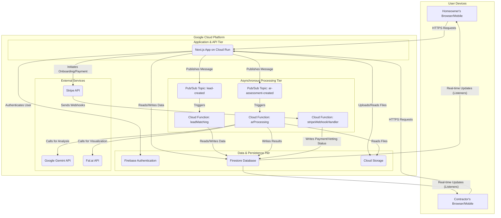
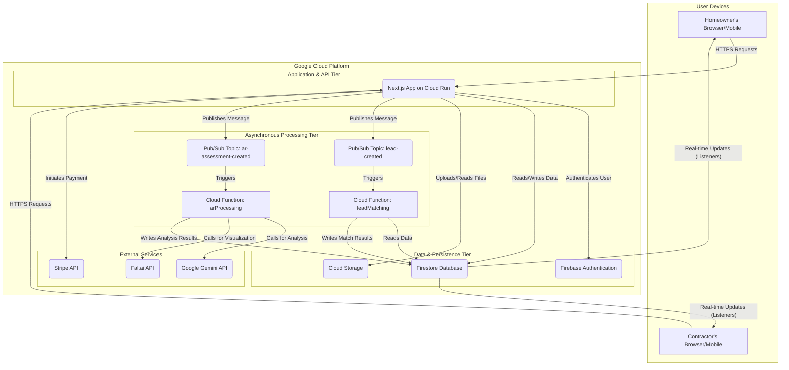
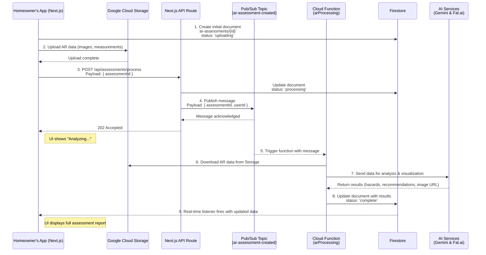
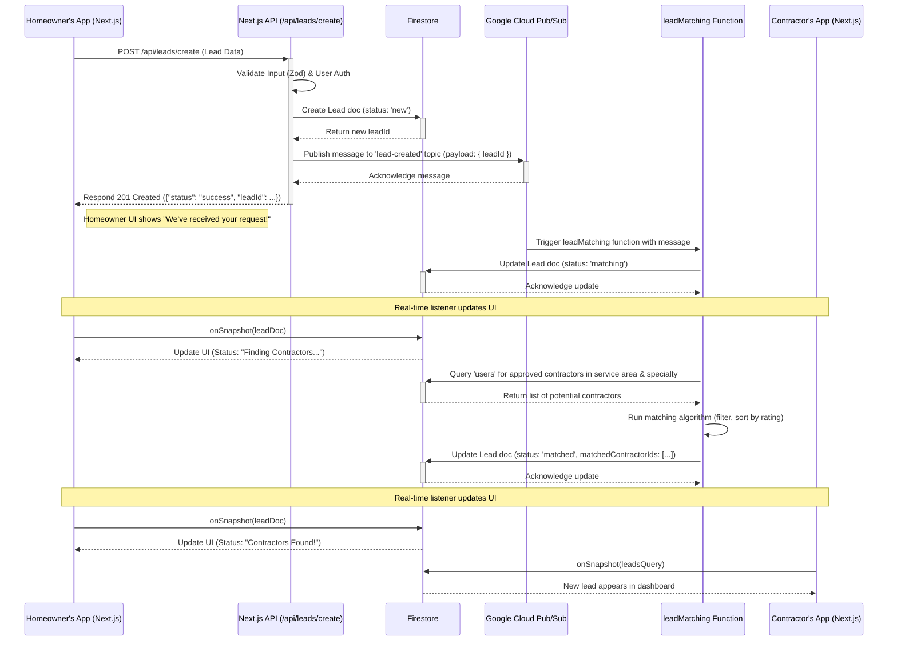
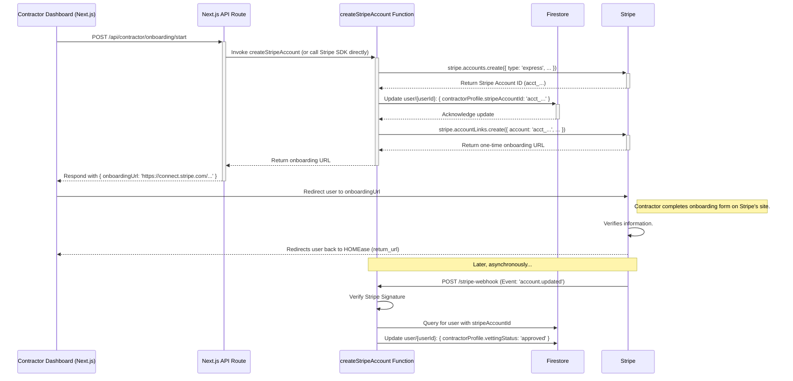
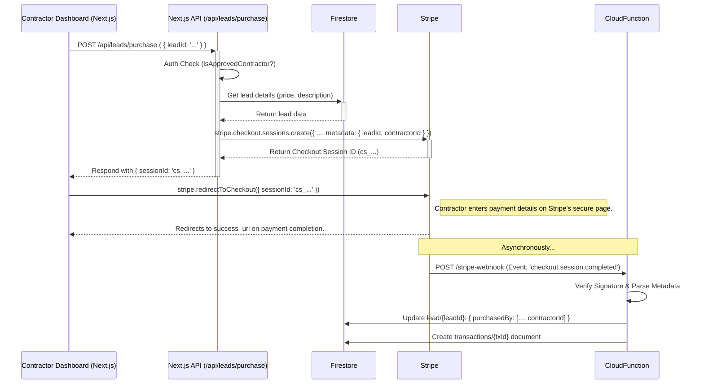

# Agent Response - orchestrator_workers

**Session ID**: 1d8ed662-c6e2-46f3-a121-2d3cd50b49ae
**Processing Time**: 344.74 seconds

## Final Response

Here is a solid, detailed technical architecture plan for the HOMEase AI platform, synthesized from the provided documentation and designed for execution by a development team.

### **Executive Summary**

This document presents the comprehensive technical architecture for the HOMEase AI platform, a lead generation service connecting homeowners with aging-in-place (AIP) contractors. The architecture is designed to be scalable, secure, and cost-efficient, directly supporting the business's strategic pivot to a pure-play lead generation model.

The platform is built exclusively on the Google Cloud Platform (GCP) ecosystem, leveraging a serverless, event-driven model to achieve rapid development cycles and operational efficiency. The core components include a Next.js 15 frontend hosted on **Google Cloud Run** (explicitly excluding Vercel), a suite of backend services using **Google Cloud Functions**, and a unified data layer with **Firebase Firestore, Authentication, and Storage**.

Key architectural features include:

* **Asynchronous Workflows:** Core processes like AR assessment analysis and contractor matching are handled asynchronously using Google Cloud Pub/Sub, ensuring a responsive user experience.
* **Role-Based Access Control (RBAC):** A robust security model using Firebase Custom Claims and NextAuth.js enforces strict permissions for homeowners, contractors, and administrators across the entire application stack.
* **Integrated Payments & Vetting:** A seamless contractor onboarding and payment system is built using Stripe Connect and Stripe Checkout, automated via secure webhooks.
* **Automated CI/CD:** A complete DevOps pipeline using GitHub Actions and Google Cloud's Workload Identity Federation enables secure, automated deployments to isolated development, staging, and production environments.

This plan provides a blueprint for building a high-performance, secure, and scalable platform poised to capture a significant share of the growing AIP market.

---

### **1. High-Level System Architecture**

HOMEase AI employs a serverless, event-driven architecture hosted entirely on GCP. This model is chosen for its inherent scalability, pay-per-use cost structure, and reduced operational overhead.

#### **1.1. Core Technology Stack**

* **Frontend & Primary Backend:** Next.js 15 (App Router, TypeScript)
* **Deployment Host:** Google Cloud Run
* **Database:** Google Firestore (NoSQL, real-time)
* **Authentication:** Firebase Authentication with NextAuth.js v5
* **File Storage:** Google Cloud Storage (via Firebase Storage SDK)
* **Background Processing:** Google Cloud Functions (2nd Gen)
* **Messaging/Event Bus:** Google Cloud Pub/Sub
* **AI/ML:** Google Gemini API (Analysis), Fal.ai (Visualization)
* **Payments:** Stripe (Connect & Checkout)
* **CI/CD:** GitHub Actions & Google Cloud Build

#### **1.2. Architecture Diagram**

The diagram below illustrates the interaction between system components. The Next.js application on Cloud Run serves as the primary interface, orchestrating calls to backend services and responding to real-time database updates.



---

### **2. Data Modeling & Persistence**

The data layer is built on Firestore, a scalable NoSQL database. The schema is designed with denormalization to optimize for the application's primary read patterns.

#### **2.1. Firestore Collection Schema**

* **`users`**: Stores profiles for all roles (`homeowner`, `contractor`, `admin`), identified by their Firebase Auth UID. Contractor profiles include a `contractorProfile` map containing vetting status, specialties, service area ZIPs, and their `stripeAccountId`.
* **`leads`**: Represents a homeowner's request for work. It includes denormalized homeowner info, the `arAssessmentId`, status (`new`, `matching`, `matched`, `sold`), price, and arrays for `matchedContractorIds` and `purchasedBy` contractor IDs.
* **`ar-assessments`**: Contains the results of an AR scan, including `status` (`processing`, `complete`), links to raw data in Cloud Storage, and the final `results` from the Gemini AI analysis.
* **`projects`**: Tracks a confirmed job between a homeowner and contractor, linking the lead, participants, and final scope.
* **`chats`**: Manages conversation threads, with a `messages` subcollection for individual messages.
* **`reviews`**: Stores ratings and comments for completed projects. An `onWrite` Cloud Function aggregates these reviews to update a contractor's average rating in their `users` document.
* **`transactions`**: Logs all payment events from Stripe for accounting and auditing, using the Stripe session or payment intent ID as the document ID for idempotency.

#### **2.2. Firestore Security Rules**

Security rules are the primary mechanism for enforcing data access control at the database level. They are non-negotiable and protect data even if the application backend is compromised.

* **Users**: Users can read and update their own profiles. Public contractor information is readable by any authenticated user. Admins have full access.
* **Leads**: A lead can be read only by its owner, a matched contractor, or an admin. Only homeowners can create leads.
* **AR Assessments**: Can only be accessed by the user who created it or an admin.
* **Chats & Messages**: Can only be accessed by the participants of the chat.
* **Reviews**: Are public to read but can only be created by the homeowner of a completed project. Reviews are immutable by users.

---

### **3. Authentication & Role-Based Access Control (RBAC)**

A multi-layered RBAC strategy ensures that users can only perform actions and access data appropriate for their role.

1. **Authentication Provider**: **NextAuth.js v5** is used with the **Firebase Auth provider**. Firebase securely manages user credentials, social logins, and issues ID tokens.
2. **Authoritative Role Source**: **Firebase Custom Claims** are the single source of truth for user roles (`homeowner`, `contractor`, `admin`).
3. **Role Assignment**: Upon user signup, a Cloud Function (`onUserCreate`) is triggered. It reads the user's intended role (set during the signup flow) from a temporary Firestore document and uses the Firebase Admin SDK to write the role as a custom claim to the user's auth token. This process is entirely server-side and secure from client-side manipulation.
4. **Session Propagation**: NextAuth.js is configured to decode the user's ID token upon login, extract the custom `role` claim, and inject it into the session object.
5. **Permission Enforcement**:
    * **Next.js (Server Components & API Routes)**: Server-side code checks `session.user.role` to authorize access to pages and API endpoints.
    * **Next.js (Client Components)**: The UI is conditionally rendered based on the `role` available in the `useSession()` hook.
    * **Cloud Functions**: Callable Functions automatically receive a verified auth `context` containing the decoded token and its claims, allowing for role checks at the start of any backend process.
    * **Firestore Rules**: Rules use helper functions to read the user's role from their request token (`request.auth.token.role`) to enforce database-level permissions.

---

### **4. Core Workflows**

The platform's primary functions are designed as decoupled, asynchronous workflows to ensure scalability and a responsive user experience.

#### **4.1. AR Assessment & AI Processing**

1. **Upload**: The homeowner's app uploads raw AR data (images, measurements) directly to a secure path in **Google Cloud Storage**.
2. **Trigger**: Upon successful upload, the app calls a lightweight Next.js API route (`/api/ar-assessments/process`), which updates the assessment's status in Firestore to `'processing'` and publishes a message to the `ar-assessment-created` **Pub/Sub topic**.
3. **Process**: An event-driven **Cloud Function (`arProcessing`)** is triggered by the Pub/Sub message. It downloads the data from Storage, sends it to the **Google Gemini API** for hazard detection and recommendations, and calls **Fal.ai** to generate "after" visualizations.
4. **Update**: The function writes the complete analysis back to the assessment's Firestore document and updates its status to `'complete'`.
5. **Notify**: The homeowner's app, listening for real-time changes to the document, automatically updates the UI to display the full report.

#### **4.2. Lead Generation & Contractor Matching**

1. **Submission**: A homeowner submits a lead request via a Next.js form. The API route (`/api/leads/create`) validates the data, creates a new lead document in Firestore with a status of `'new'`, and immediately publishes a message with the `leadId` to the `lead-created` **Pub/Sub topic**.
2. **Matching**: The `leadMatching` **Cloud Function** is triggered. It updates the lead status to `'matching'`, then queries the `users` collection for approved contractors whose `serviceAreaZips` and `specialties` match the lead's requirements.
3. **Ranking & Update**: The function ranks the potential matches (e.g., by average rating, review count) and updates the lead document in Firestore with an array of the top `matchedContractorIds` and a new status of `'matched'`.
4. **Notify**: Both the homeowner and the matched contractors receive real-time updates in their dashboards via Firestore listeners, informing them of the match.

#### **4.3. Contractor Onboarding & Payments**

1. **Onboarding**: The system uses **Stripe Connect Express**. A contractor initiates onboarding from their dashboard, triggering a server-side process that creates a Stripe Express account and generates a one-time onboarding link. The contractor is redirected to Stripe's co-branded UI to submit their business and bank details.
2. **Verification**: Stripe handles the identity verification asynchronously. When the account is verified, Stripe sends an `account.updated` event to a secure webhook endpoint.
3. **Pay-Per-Lead Purchase**: An approved contractor can purchase a lead. This action calls a Next.js API route that creates a **Stripe Checkout Session**, embedding the `leadId` and `contractorId` in the session's `metadata`. The contractor is redirected to Stripe's secure payment page.
4. **Webhook Handling**: A single, secure **Cloud Function (`stripeWebhookHandler`)** with an HTTP trigger acts as the endpoint for all Stripe webhooks. It verifies the Stripe signature of every incoming request.
    * On an `account.updated` event, it updates the contractor's `vettingStatus` in Firestore to `'approved'`.
    * On a `checkout.session.completed` event, it reads the `metadata` to identify the lead and contractor, then updates the lead document in Firestore to grant the contractor access.

---

### **5. Frontend Architecture (Next.js 15 on Cloud Run)**

The frontend is a monolithic Next.js 15 application using the App Router, prioritizing performance and maintainability with a "Server-First" approach.

* **Component Strategy**: **React Server Components (RSCs)** are used by default to fetch data and render UI on the server, minimizing client-side JavaScript. **Client Components (`'use client'`)** are used only when necessary for interactivity, such as forms, AR uploaders, and real-time chat windows.
* **Directory Structure**: A feature-based directory structure (`/src/app/(dashboard)/contractor`, `/src/components/features/leads`) keeps the codebase organized.
* **Styling**: **Tailwind CSS** with **Shadcn/UI** provides a modern, utility-first design system.
* **Deployment Container**: The application is containerized using a multi-stage `Dockerfile` that builds the app and copies the optimized standalone output into a lean `node:20-alpine` image. This creates a small, secure image ideal for Cloud Run.

---

### **6. Deployment & DevOps (CI/CD)**

A fully automated CI/CD pipeline using GitHub Actions ensures reliable and frequent deployments to GCP.

* **Environments**: Three isolated GCP projects (`homease-ai-dev`, `-staging`, `-prod`) provide complete separation for Development, Staging, and Production environments.
* **Branching Strategy**: A GitFlow model is used. Merges to `develop`, `staging`, and `main` branches trigger deployments to their corresponding environments.
* **Secure Authentication**: **Workload Identity Federation (WIF)** provides a secure, keyless mechanism for GitHub Actions to authenticate with GCP. This eliminates the need to store long-lived service account keys as GitHub secrets.
* **Workflows**:
    1. **PR Validation**: On every pull request to `develop`, a workflow runs linting, type-checking, and tests to maintain code quality.
    2. **Frontend Deployment**: On pushes to key branches, a workflow builds the Next.js Docker image, pushes it to **Google Artifact Registry**, and deploys it as a new revision to **Google Cloud Run**. Secrets are securely injected from **Google Secret Manager**.
    3. **Backend Deployment**: A separate workflow, triggered by changes in the `/functions` directory or rules files, uses the Firebase CLI to deploy Cloud Functions, Firestore rules, and Storage rules to the appropriate GCP project.

---

### **7. Security, Compliance, and Vetting**

Security is a foundational principle, integrated at every layer of the platform.

* **Application Security**:
  * **Content Security Policy (CSP)**: A strict CSP is enforced via Next.js middleware to prevent XSS attacks.
  * **Input Validation**: **Zod** is used to validate all incoming data on every API endpoint and Cloud Function, preventing injection attacks and ensuring data integrity.
  * **Secure Headers**: Standard security headers (HSTS, X-Content-Type-Options) are configured.
* **Compliance**:
  * **CCPA**: The platform provides users with the right to know, delete, and opt-out of data sales (which HOMEase does not do).
  * **'HIPAA-lite'**: While not a covered entity, HOMEase AI treats home accessibility data as sensitive. We practice **data minimization** (collecting only functional needs, not medical diagnoses) and enforce strict access controls.
  * **Encryption**: All data is encrypted in transit (TLS 1.3) and at rest (Google-managed AES-256).
* **Contractor Vetting**: A multi-stage process ensures contractor quality.
    1. **Submission**: Contractors upload licenses and proof of insurance to a secure Cloud Storage bucket.
    2. **Verification**: An internal admin team verifies these documents and initiates a third-party background check (e.g., via Checkr).
    3. **Status Management**: The contractor's `vettingStatus` (`pending`, `approved`, `rejected`) is managed in their Firestore document via an admin-only dashboard. Only `'approved'` contractors are eligible for lead matching.
    4. **Secure Storage**: Firebase Storage rules ensure that vetting documents can only be uploaded by the contractor and read by authorized administrators.

## Intermediate Steps

### Task Coordinator

Task Understanding:
The user requires a detailed technical architecture plan for the HOMEase AI platform, a lead generation service for home modification contractors. The plan must be based on the provided business documentation, adhere to modern web development best practices, and follow a specific technology stack (Next.js 15, Firebase, Google Cloud). A critical constraint is that the platform must NOT use Vercel for hosting, requiring an alternative deployment strategy on Google Cloud. The final output must be a structured plan suitable for execution by a team of engineers.

Execution Strategy:
The project will be executed in three main phases.
Phase 1: Foundation & Core Architecture. This involves establishing the overall system design, data models, authentication, security protocols, and project structure. This phase is critical as it lays the groundwork for all subsequent development.
Phase 2: Feature Implementation. This phase focuses on building the primary user-facing features, including the Next.js frontend, the AR Assessment flow with AI integration, and the core lead generation and contractor matching logic.
Phase 3: Monetization & Operations. This final phase involves integrating the payment system, refining the contractor onboarding process, and establishing a robust CI/CD pipeline for automated testing and deployment to Google Cloud.

The strategy emphasizes an API-first, serverless, and event-driven approach, leveraging Google Cloud and Firebase services to meet the platform's requirements for scalability, security, and rapid development. The explicit constraint of not using Vercel is addressed by deploying the Next.js application to Google Cloud Run.

Subtasks:

1. Define High-Level System Architecture & GCP Deployment Strategy (Priority: 1, Expertise: Cloud Solutions Architect)
   Description: Synthesize the provided business documents to define the high-level system architecture. Create a comprehensive architecture diagram illustrating the interaction between the Next.js frontend (on Google Cloud Run), Firebase services (Auth, Firestore, Storage), Google Cloud Functions, and Pub/Sub. This plan must explicitly address the 'no Vercel' constraint by detailing the Google Cloud Run hosting strategy for the Next.js application.
   Dependencies: None
2. Design Firestore Data Models and Security Rules (Priority: 2, Expertise: Database Architect)
   Description: Design the Firestore NoSQL database schema. This includes defining collections for users (with roles for homeowners, contractors, admins), leads, ar-assessments, projects, chat messages, and reviews. Plan for necessary data denormalization to optimize read performance for common queries and design the corresponding Firestore Security Rules to enforce access control based on user roles and data ownership.
   Dependencies: t1_architecture_overview
3. Design Authentication and Role-Based Access Control (RBAC) (Priority: 2, Expertise: Senior Full-Stack Engineer with Security Focus)
   Description: Plan the authentication and authorization strategy using NextAuth.js v5 with the Firebase Auth provider. Detail the Role-Based Access Control (RBAC) implementation, including how Firebase custom claims will be used to manage user roles. Document the process for validating these roles on both the Next.js server-side components and within the backend Google Cloud Functions.
   Dependencies: t1_architecture_overview
4. Plan AR Assessment and AI Processing Workflow (Priority: 3, Expertise: AI/ML Integration Specialist)
   Description: Detail the end-to-end asynchronous workflow for AR-based home assessments. The plan should cover: 1. Client-side data capture and upload to Firebase Storage. 2. Triggering a Pub/Sub event upon upload completion. 3. A powerful, event-driven Google Cloud Function (Gen 2) that retrieves the data, calls the Google Gemini API for analysis and recommendations, and writes the results back to the corresponding Firestore document.
   Dependencies: t1_architecture_overview, t2_data_modeling_and_firestore
5. Design Lead Generation and Contractor Matching Workflow (Priority: 3, Expertise: Senior Backend Engineer)
   Description: Design the asynchronous workflow for lead generation and contractor matching. This includes: 1. An API endpoint in Next.js to receive the initial lead data. 2. Saving the lead to Firestore and publishing a 'lead-created' message to Pub/Sub. 3. A Google Cloud Function that consumes this message, executes the contractor matching algorithm based on location, specialization, and availability, and updates the lead document. 4. Specify the use of Firestore real-time listeners on the frontend to notify users of updates.
   Dependencies: t1_architecture_overview, t2_data_modeling_and_firestore, t3_auth_and_rbac_design
6. Plan Next.js Frontend Architecture and Cloud Run Deployment (Priority: 4, Expertise: Senior Next.js Engineer)
   Description: Plan the Next.js 15 application architecture using the App Router. Prioritize React Server Components (RSCs) to minimize client-side JavaScript. Design the deployment process for the Next.js application to Google Cloud Run, including creating an optimized multi-stage Dockerfile and a script for managing environment variables and secrets via Google Secret Manager.
   Dependencies: t1_architecture_overview
7. Design Payment and Contractor Onboarding System (Priority: 5, Expertise: Backend Engineer with Stripe Integration Experience)
   Description: Design the payment and contractor onboarding process using Stripe. Plan the integration with Stripe Connect for verifying contractor identities and business details. Design the pay-per-lead transaction flow. Specify the architecture for using Google Cloud Functions to handle Stripe webhooks securely, ensuring that events like 'account.updated' or 'checkout.session.completed' reliably update the relevant Firestore documents.
   Dependencies: t3_auth_and_rbac_design, t5_lead_matching_workflow
8. Plan CI/CD Pipeline with GitHub Actions for GCP (Priority: 6, Expertise: DevOps Engineer)
   Description: Design the full CI/CD pipeline using GitHub Actions. Create distinct, reusable workflows for: 1. Linting, type-checking, and running tests on every pull request. 2. A deployment workflow for the Next.js application to Google Cloud Run. 3. A separate deployment workflow for Google Cloud Functions, Firestore rules, and other Firebase assets. The plan must include strategies for managing multiple environments (dev, staging, production).
   Dependencies: t1_architecture_overview, t6_nextjs_on_gcp_architecture
9. Develop Security, Compliance, and Contractor Vetting Plan (Priority: 2, Expertise: Security Architect)
   Description: Create a comprehensive security and compliance plan. This includes defining a strict Content Security Policy (CSP), detailing input validation strategies using Zod across all endpoints, and outlining the approach to meet 'HIPAA-lite' and CCPA requirements through data minimization, access logs, and encryption. Also, detail the technical implementation of the multi-stage contractor vetting process, specifying how verification status (licenses, insurance, background checks) will be stored and managed securely.
   Dependencies: t2_data_modeling_and_firestore, t3_auth_and_rbac_design

**Metadata:**

```json
{
  "subtasks": [
    {
      "id": "t1_architecture_overview",
      "required_expertise": "Cloud Solutions Architect",
      "dependencies": [],
      "title": "Define High-Level System Architecture & GCP Deployment Strategy",
      "priority": 1,
      "description": "Synthesize the provided business documents to define the high-level system architecture. Create a comprehensive architecture diagram illustrating the interaction between the Next.js frontend (on Google Cloud Run), Firebase services (Auth, Firestore, Storage), Google Cloud Functions, and Pub/Sub. This plan must explicitly address the 'no Vercel' constraint by detailing the Google Cloud Run hosting strategy for the Next.js application."
    },
    {
      "id": "t2_data_modeling_and_firestore",
      "priority": 2,
      "description": "Design the Firestore NoSQL database schema. This includes defining collections for users (with roles for homeowners, contractors, admins), leads, ar-assessments, projects, chat messages, and reviews. Plan for necessary data denormalization to optimize read performance for common queries and design the corresponding Firestore Security Rules to enforce access control based on user roles and data ownership.",
      "dependencies": [
        "t1_architecture_overview"
      ],
      "title": "Design Firestore Data Models and Security Rules",
      "required_expertise": "Database Architect"
    },
    {
      "priority": 2,
      "id": "t3_auth_and_rbac_design",
      "required_expertise": "Senior Full-Stack Engineer with Security Focus",
      "dependencies": [
        "t1_architecture_overview"
      ],
      "description": "Plan the authentication and authorization strategy using NextAuth.js v5 with the Firebase Auth provider. Detail the Role-Based Access Control (RBAC) implementation, including how Firebase custom claims will be used to manage user roles. Document the process for validating these roles on both the Next.js server-side components and within the backend Google Cloud Functions.",
      "title": "Design Authentication and Role-Based Access Control (RBAC)"
    },
    {
      "priority": 3,
      "id": "t4_ar_assessment_and_ai_flow",
      "required_expertise": "AI/ML Integration Specialist",
      "title": "Plan AR Assessment and AI Processing Workflow",
      "description": "Detail the end-to-end asynchronous workflow for AR-based home assessments. The plan should cover: 1. Client-side data capture and upload to Firebase Storage. 2. Triggering a Pub/Sub event upon upload completion. 3. A powerful, event-driven Google Cloud Function (Gen 2) that retrieves the data, calls the Google Gemini API for analysis and recommendations, and writes the results back to the corresponding Firestore document.",
      "dependencies": [
        "t1_architecture_overview",
        "t2_data_modeling_and_firestore"
      ]
    },
    {
      "id": "t5_lead_matching_workflow",
      "description": "Design the asynchronous workflow for lead generation and contractor matching. This includes: 1. An API endpoint in Next.js to receive the initial lead data. 2. Saving the lead to Firestore and publishing a 'lead-created' message to Pub/Sub. 3. A Google Cloud Function that consumes this message, executes the contractor matching algorithm based on location, specialization, and availability, and updates the lead document. 4. Specify the use of Firestore real-time listeners on the frontend to notify users of updates.",
      "required_expertise": "Senior Backend Engineer",
      "priority": 3,
      "title": "Design Lead Generation and Contractor Matching Workflow",
      "dependencies": [
        "t1_architecture_overview",
        "t2_data_modeling_and_firestore",
        "t3_auth_and_rbac_design"
      ]
    },
    {
      "priority": 4,
      "id": "t6_nextjs_on_gcp_architecture",
      "dependencies": [
        "t1_architecture_overview"
      ],
      "required_expertise": "Senior Next.js Engineer",
      "description": "Plan the Next.js 15 application architecture using the App Router. Prioritize React Server Components (RSCs) to minimize client-side JavaScript. Design the deployment process for the Next.js application to Google Cloud Run, including creating an optimized multi-stage Dockerfile and a script for managing environment variables and secrets via Google Secret Manager.",
      "title": "Plan Next.js Frontend Architecture and Cloud Run Deployment"
    },
    {
      "priority": 5,
      "dependencies": [
        "t3_auth_and_rbac_design",
        "t5_lead_matching_workflow"
      ],
      "description": "Design the payment and contractor onboarding process using Stripe. Plan the integration with Stripe Connect for verifying contractor identities and business details. Design the pay-per-lead transaction flow. Specify the architecture for using Google Cloud Functions to handle Stripe webhooks securely, ensuring that events like 'account.updated' or 'checkout.session.completed' reliably update the relevant Firestore documents.",
      "id": "t7_payments_and_onboarding",
      "required_expertise": "Backend Engineer with Stripe Integration Experience",
      "title": "Design Payment and Contractor Onboarding System"
    },
    {
      "dependencies": [
        "t1_architecture_overview",
        "t6_nextjs_on_gcp_architecture"
      ],
      "required_expertise": "DevOps Engineer",
      "id": "t8_cicd_and_devops_plan",
      "description": "Design the full CI/CD pipeline using GitHub Actions. Create distinct, reusable workflows for: 1. Linting, type-checking, and running tests on every pull request. 2. A deployment workflow for the Next.js application to Google Cloud Run. 3. A separate deployment workflow for Google Cloud Functions, Firestore rules, and other Firebase assets. The plan must include strategies for managing multiple environments (dev, staging, production).",
      "priority": 6,
      "title": "Plan CI/CD Pipeline with GitHub Actions for GCP"
    },
    {
      "required_expertise": "Security Architect",
      "priority": 2,
      "description": "Create a comprehensive security and compliance plan. This includes defining a strict Content Security Policy (CSP), detailing input validation strategies using Zod across all endpoints, and outlining the approach to meet 'HIPAA-lite' and CCPA requirements through data minimization, access logs, and encryption. Also, detail the technical implementation of the multi-stage contractor vetting process, specifying how verification status (licenses, insurance, background checks) will be stored and managed securely.",
      "id": "t9_security_and_compliance",
      "dependencies": [
        "t2_data_modeling_and_firestore",
        "t3_auth_and_rbac_design"
      ],
      "title": "Develop Security, Compliance, and Contractor Vetting Plan"
    }
  ],
  "execution_strategy": "The project will be executed in three main phases. \nPhase 1: Foundation & Core Architecture. This involves establishing the overall system design, data models, authentication, security protocols, and project structure. This phase is critical as it lays the groundwork for all subsequent development.\nPhase 2: Feature Implementation. This phase focuses on building the primary user-facing features, including the Next.js frontend, the AR Assessment flow with AI integration, and the core lead generation and contractor matching logic.\nPhase 3: Monetization & Operations. This final phase involves integrating the payment system, refining the contractor onboarding process, and establishing a robust CI/CD pipeline for automated testing and deployment to Google Cloud.\n\nThe strategy emphasizes an API-first, serverless, and event-driven approach, leveraging Google Cloud and Firebase services to meet the platform's requirements for scalability, security, and rapid development. The explicit constraint of not using Vercel is addressed by deploying the Next.js application to Google Cloud Run.",
  "task_understanding": "The user requires a detailed technical architecture plan for the HOMEase AI platform, a lead generation service for home modification contractors. The plan must be based on the provided business documentation, adhere to modern web development best practices, and follow a specific technology stack (Next.js 15, Firebase, Google Cloud). A critical constraint is that the platform must NOT use Vercel for hosting, requiring an alternative deployment strategy on Google Cloud. The final output must be a structured plan suitable for execution by a team of engineers."
}
```

### Cloud Solutions Architect Specialist

Here is the detailed technical architecture plan for the HOMEase AI platform, with a specific focus on the high-level system architecture and deployment strategy on Google Cloud.

### **HOMEase AI: Technical Architecture Plan**

This document outlines the technical architecture for the HOMEase AI platform. It is designed to be scalable, secure, and capital-efficient, aligning with the business's strategic pivot to a pure-play lead generation model.

**A critical constraint of this plan is the explicit exclusion of Vercel for deployment.** The architecture is therefore centered entirely within the Google Cloud Platform (GCP) ecosystem to ensure seamless integration, unified billing, and consolidated security management.

---

### **1. High-Level System Architecture**

HOMEase AI will be built on a serverless, event-driven architecture hosted exclusively on Google Cloud Platform. This model is chosen for its inherent scalability, cost-effectiveness (pay-for-what-you-use), and reduced operational overhead, directly supporting the business goals of being "cheaper to run" and "easy to scale."

The architecture is logically divided into four main tiers:

1. **Client Tier:** The user-facing applications, including the homeowner's AR-enabled web app and the contractor's dashboard.
2. **Application & API Tier:** The core business logic, serving client requests and orchestrating backend processes. This is handled by a Next.js application and dedicated serverless functions.
3. **Asynchronous Processing Tier:** The engine for handling computationally intensive, long-running, or non-blocking tasks like AR data analysis and lead matching.
4. **Data & Persistence Tier:** The unified backend for storing, managing, and securing all platform data, from user profiles to AR scans.

#### **1.1. Core Technology Stack**

* **Frontend & Primary Backend:** Next.js 15 (with App Router, TypeScript)
* **Deployment Host:** Google Cloud Run (for the Next.js application)
* **Database:** Google Firestore (NoSQL, real-time)
* **Authentication:** Firebase Authentication (integrated with NextAuth.js v5)
* **File Storage:** Google Cloud Storage (via Firebase Storage SDK)
* **Background Processing:** Google Cloud Functions (2nd gen)
* **Messaging/Event Bus:** Google Cloud Pub/Sub
* **AI/ML:** Google Gemini API (for analysis), Fal.ai (for visualization)
* **Payments:** Stripe
* **CI/CD:** Google Cloud Build & GitHub Actions

#### **1.2. Architecture Diagram**

The following diagram illustrates the flow of information and interaction between the system components.



#### **1.3. Component Interaction & Key Flows**

* **User Interaction:** Both Homeowners and Contractors access the platform via a single, responsive Next.js application. Role-based access control (RBAC) within the Next.js backend will serve the appropriate UI and data for each user type.
* **Authentication:** A user signs up or logs in via the Next.js app. NextAuth.js, using the Firebase Auth adapter, handles the authentication flow. Firebase Auth securely manages user credentials and issues tokens, which are validated by the Next.js backend on every request.
* **Lead Creation (Event-Driven):**
    1. A homeowner submits a new lead request through the Next.js UI.
    2. The Next.js backend API (`/api/leads`) validates the input (using Zod) and writes the initial lead data to a `leads` collection in Firestore.
    3. Immediately after, it publishes a message with the `leadId` to the `lead-created` Pub/Sub topic. This decouples the API response from the heavy lifting of matching.
    4. The `leadMatching` Cloud Function, subscribed to this topic, is triggered. It performs the complex logic of finding suitable contractors based on location, specialty, and availability.
    5. The function updates the lead document in Firestore with the matched contractors.
    6. The homeowner and matched contractors receive real-time updates in their dashboards via Firestore's real-time listeners.
* **AR Processing (Event-Driven):**
    1. A homeowner uploads AR scan data (images, measurements) through the Next.js app.
    2. The Next.js backend uploads the large files to Cloud Storage and creates an initial assessment document in Firestore with a `status: 'processing'` flag.
    3. It then publishes a message with the `assessmentId` to the `ar-assessment-created` Pub/Sub topic.
    4. The `arProcessing` Cloud Function is triggered. This function retrieves the data from Cloud Storage, sends it to the Google Gemini API for hazard detection/recommendations and to Fal.ai for visualization.
    5. Upon receiving the results, the function updates the assessment document in Firestore with the detailed analysis, hazard list, and generated "after" images. The status is changed to `status: 'complete'`.
    6. The homeowner's UI, listening to this document, automatically updates to display the completed assessment.

---

### **2. Deployment Strategy: Next.js on Google Cloud Run (No Vercel)**

To adhere to the "no Vercel" constraint while maintaining a modern, scalable deployment for the Next.js 15 application, we will use **Google Cloud Run**. Cloud Run is a fully managed serverless platform that allows us to run stateless containers. It is the ideal GCP-native solution for hosting a full-stack Next.js application.

#### **2.1. Containerization with Docker**

The Next.js application will be containerized using Docker. A multi-stage `Dockerfile` will be created to optimize the production image for size and security.

* **Stage 1 (Builder):** Installs dependencies, builds the Next.js application (`npm run build`), and prunes development-only dependencies.
* **Stage 2 (Runner):** Copies the built application (`.next` directory, `public`, `package.json`, `node_modules`) into a lean base image (e.g., `node:20-alpine`). It exposes the required port (e.g., 3000) and defines the command to start the Next.js server (`npm start`).

#### **2.2. CI/CD with Google Cloud Build and Artifact Registry**

We will implement a fully automated CI/CD pipeline using GitHub Actions and Google Cloud Build.

1. **Trigger:** A push or merge to the `main` or `production` branch in the GitHub repository triggers the pipeline.
2. **Build:** A `cloudbuild.yaml` file in the repository root defines the build steps for Google Cloud Build.
    * It builds the Docker image using the project's `Dockerfile`.
    * It tags the image with the commit SHA for versioning.
3. **Store:** The newly built container image is pushed to **Google Artifact Registry**, which serves as our private, secure Docker registry.
4. **Deploy:** The final step in the Cloud Build pipeline deploys the new image as a revision to our **Google Cloud Run service**. Cloud Build will use a service account with the necessary permissions (`roles/run.admin`, `roles/iam.serviceAccountUser`) to perform this action.

This setup ensures that every push to the main branch results in a tested, versioned, and automatically deployed update to the production environment with zero downtime.

#### **2.3. Cloud Run Service Configuration**

The HOMEase AI Cloud Run service will be configured for performance, scalability, and security:

* **CPU & Memory:** Allocated based on performance testing (e.g., 1 vCPU, 1GiB memory to start).
* **Scalability:**
  * **Min Instances:** Set to `1` to mitigate cold starts for a better user experience, especially during initial launch phases. Can be set to `0` to optimize for cost if traffic is highly variable.
  * **Max Instances:** Set to a reasonable limit (e.g., `20`) to handle traffic spikes while controlling costs.
* **Concurrency:** Configured to allow multiple concurrent requests per container instance (e.g., 80), which is typical for efficient Node.js applications.
* **Environment Variables & Secrets:**
  * Non-sensitive variables (e.g., `NEXT_PUBLIC_FIREBASE_API_KEY`) are set directly in the Cloud Run service configuration.
  * All sensitive keys (`STRIPE_SECRET_KEY`, `GOOGLE_GENAI_API_KEY`, `NEXTAUTH_SECRET`) will be stored in **Google Secret Manager** and securely mounted into the Cloud Run service at runtime. This is a critical security best practice.
* **Networking:** The service will be configured to allow public access (all traffic) and will be fronted by a **Google Cloud Load Balancer** with a managed SSL certificate for the custom domain (`app.homease.ai`). The load balancer also provides CDN capabilities (via Cloud CDN) for caching static assets, further improving performance.

**Metadata:**

```json
{
  "subtask_id": "t1_architecture_overview",
  "title": "Define High-Level System Architecture & GCP Deployment Strategy",
  "expertise": "Cloud Solutions Architect"
}
```

### Database Architect Specialist

Here is the detailed plan for the Firestore data models and security rules for the HOMEase AI platform.

---

### **3. Data Modeling & Firestore Schema**

The Firestore NoSQL database is structured to optimize for the primary access patterns of the application, such as fetching leads for a contractor or displaying a homeowner's project history. The design employs denormalization strategically to ensure fast read performance and reduce the number of queries required for common UI views.

#### **3.1. Collection Structure**

The following collections form the core of the database schema.

**1. `users`**
Stores profile information for all user types. A single collection is used to simplify authentication and user management.

* **Document ID:** `userId` (from Firebase Authentication `uid`)
* **Structure:**

    ```json
    {
      "uid": "string", // Firebase Auth UID
      "email": "string",
      "displayName": "string",
      "photoURL": "string", // URL to profile picture
      "role": "string", // 'homeowner', 'contractor', 'admin'
      "createdAt": "timestamp",
      "phoneNumber": "string", // optional
      "address": {
        "street": "string",
        "city": "string",
        "state": "string",
        "zip": "string"
      },

      // --- Contractor-Specific Fields ---
      "contractorProfile": {
        "companyName": "string",
        "vettingStatus": "string", // 'pending', 'approved', 'rejected'
        "licenseNumber": "string",
        "insuranceVerified": "boolean",
        "capsCertified": "boolean",
        "specialties": ["string"], // e.g., ['ramp-construction', 'bathroom-remodel']
        "serviceAreaZips": ["string"], // Array of zip codes served
        "bio": "string",
        // Denormalized for performance
        "averageRating": "number", // Calculated by a Cloud Function
        "reviewCount": "number"    // Calculated by a Cloud Function
      }
    }
    ```

**2. `leads`**
Represents a work request initiated by a homeowner.

* **Document ID:** Auto-generated
* **Structure:**

    ```json
    {
      "homeownerId": "string", // UID of the creating user
      "status": "string", // 'new', 'matching', 'matched', 'in_progress', 'closed', 'cancelled'
      "urgency": "string", // 'low', 'medium', 'high'
      "budgetRange": "string", // e.g., '$5k-$10k'
      "description": "string",
      "createdAt": "timestamp",
      "updatedAt": "timestamp",
      "arAssessmentId": "string", // Link to the 'ar-assessments' document

      // --- Denormalized Homeowner Info ---
      "homeownerInfo": {
        "displayName": "string",
        "city": "string",
        "state": "string",
        "zip": "string"
      },

      // --- Matched Contractor Info ---
      "matchedContractorIds": ["string"], // Array of matched contractor UIDs
      "viewedByContractors": ["string"] // Array of UIDs of contractors who have viewed the lead
    }
    ```

**3. `ar-assessments`**
Stores the data and results from an AR scan.

* **Document ID:** Auto-generated
* **Structure:**

    ```json
    {
      "userId": "string", // UID of the homeowner who created it
      "leadId": "string", // Link back to the lead if applicable
      "status": "string", // 'pending', 'processing', 'complete', 'failed'
      "createdAt": "timestamp",
      "storageRefs": { // Paths to raw data in Cloud Storage
        "video": "string",
        "measurementsJson": "string"
      },
      "results": {
        "hazards": [
          { "type": "string", "description": "string", "severity": "number" }
        ],
        "recommendations": [
          { "modification": "string", "details": "string" }
        ],
        "visualizationUrl": "string" // URL to the 'after' image from Fal.ai
      }
    }
    ```

**4. `projects`**
Represents a confirmed job between a homeowner and a contractor.

* **Document ID:** Auto-generated
* **Structure:**

    ```json
    {
      "leadId": "string",
      "homeownerId": "string",
      "contractorId": "string",
      "status": "string", // 'upcoming', 'active', 'completed', 'disputed'
      "scopeOfWork": "string", // Finalized SOW
      "finalBudget": "number",
      "startDate": "timestamp",
      "completionDate": "timestamp",
      "chatId": "string" // Link to the 'chats' document for this project
    }
    ```

**5. `chats`**
A top-level collection to manage conversation threads.

* **Document ID:** Auto-generated (or a composite key like `{leadId}_{contractorId}`)
* **Structure:**

    ```json
    {
      "participantIds": ["string"], // [homeownerId, contractorId]
      "lastMessage": {
        "text": "string",
        "timestamp": "timestamp"
      },
      "createdAt": "timestamp"
    }
    ```

* **Subcollection:** `messages`
  * **Document ID:** Auto-generated
  * **Structure:**

        ```json
        {
          "senderId": "string",
          "text": "string",
          "timestamp": "timestamp",
          "readBy": ["string"]
        }
        ```

**6. `reviews`**
Stores ratings and feedback for completed projects.

* **Document ID:** Auto-generated (or `projectId` for uniqueness)
* **Structure:**

    ```json
    {
      "projectId": "string",
      "homeownerId": "string",
      "contractorId": "string",
      "rating": "number", // 1-5
      "comment": "string",
      "createdAt": "timestamp"
    }
    ```

  * **Note:** A Cloud Function will be triggered `onWrite` to this collection to update the `averageRating` and `reviewCount` fields in the contractor's `users` document.

---

### **3.2. Firestore Security Rules**

These rules enforce the business logic at the database layer, ensuring users can only access data they are authorized to see. This is a critical security measure that works independently of the application backend.

Filename: `firestore.rules`

```javascript
rules_version = '2';

service cloud.firestore {
  match /databases/{database}/documents {

    // --- Helper Functions ---
    function isSignedIn() {
      return request.auth != null;
    }

    function isUser(userId) {
      return isSignedIn() && request.auth.uid == userId;
    }

    function getUserData(userId) {
      return get(/databases/$(database)/documents/users/$(userId)).data;
    }

    function isRole(role) {
      let userRole = getUserData(request.auth.uid).role;
      return userRole == role;
    }

    function isAdmin() {
      return isSignedIn() && isRole('admin');
    }

    // --- Collection Rules ---

    // USERS: Users can manage their own profile. Admins have full access.
    // Public contractor data is readable by anyone signed in.
    match /users/{userId} {
      allow read: if isSignedIn() && (isUser(userId) || getUserData(userId).role == 'contractor');
      allow create: if isSignedIn() && request.resource.data.uid == request.auth.uid;
      allow update: if isUser(userId) || isAdmin();
      // No user should be able to delete their own account via a direct API call.
      allow delete: if isAdmin();
    }

    // LEADS: Homeowners can create/manage their own leads. Matched contractors can read them.
    match /leads/{leadId} {
      allow read: if isSignedIn() && (
                    isUser(resource.data.homeownerId) ||
                    request.auth.uid in resource.data.matchedContractorIds ||
                    isAdmin()
                  );
      allow create: if isSignedIn() && isRole('homeowner') &&
                     request.resource.data.homeownerId == request.auth.uid;
      allow update: if isSignedIn() && (isUser(resource.data.homeownerId) || isAdmin());
      allow delete: if isSignedIn() && (isUser(resource.data.homeownerId) || isAdmin());
    }

    // AR-ASSESSMENTS: Only the creating user and admins can access.
    match /ar-assessments/{assessmentId} {
      allow read, write: if isSignedIn() && (isUser(resource.data.userId) || isAdmin());
      allow create: if isSignedIn() && isRole('homeowner') &&
                     request.resource.data.userId == request.auth.uid;
    }

    // PROJECTS: Only the involved homeowner, contractor, or an admin can access.
    match /projects/{projectId} {
      allow read, write: if isSignedIn() && (
                           isUser(resource.data.homeownerId) ||
                           isUser(resource.data.contractorId) ||
                           isAdmin()
                         );
      // Project creation is handled by server-side logic (Cloud Function), not direct client access.
      allow create: if isAdmin(); // Or a specific server role if configured
    }

    // CHATS & MESSAGES: Only participants in the chat can read/write messages.
    match /chats/{chatId} {
      // Allow reading/writing the chat document metadata if you are a participant.
      allow read, write: if isSignedIn() && request.auth.uid in resource.data.participantIds;

      // Rules for the messages subcollection
      match /messages/{messageId} {
        allow read, create: if isSignedIn() &&
                             request.auth.uid in get(/databases/$(database)/documents/chats/$(chatId)).data.participantIds;
        // Messages are immutable once sent.
        allow update, delete: if isAdmin();
      }
    }

    // REVIEWS: Homeowners can create reviews for projects they were part of.
    // Reviews are public to read but cannot be modified after creation except by an admin.
    match /reviews/{reviewId} {
      allow read: if true; // Reviews are public
      allow create: if isSignedIn() && isRole('homeowner') &&
                     // Verify the user was the homeowner on the completed project.
                     get(/databases/$(database)/documents/projects/$(request.resource.data.projectId)).data.homeownerId == request.auth.uid &&
                     get(/databases/$(database)/documents/projects/$(request.resource.data.projectId)).data.status == 'completed';
      // Reviews are immutable by users.
      allow update, delete: if isAdmin();
    }
  }
}
```

**Metadata:**

```json
{
  "subtask_id": "t2_data_modeling_and_firestore",
  "title": "Design Firestore Data Models and Security Rules",
  "expertise": "Database Architect"
}
```

### Senior Full-Stack Engineer with Security Focus Specialist

Here is the detailed technical plan for Authentication and Role-Based Access Control (RBAC) for the HOMEase AI platform.

---

### **3. Authentication and Role-Based Access Control (RBAC)**

This section details the authentication and authorization strategy for the HOMEase AI platform. The implementation leverages NextAuth.js v5 with the Firebase Auth provider, using Firebase Custom Claims as the cornerstone for a robust and secure Role-Based Access Control (RBAC) system. This approach ensures that user identity is managed securely by Firebase, while access control is enforced consistently across the entire architecture, from the Next.js frontend to the backend Google Cloud Functions.

#### **3.1. Authentication Flow and User Signup**

The authentication flow is designed to be secure and provide a seamless user experience. It differentiates between the platform's two primary user types—homeowners and contractors—from the moment of registration.

1. **User Registration:** The Next.js application will feature distinct registration paths: one for "Homeowners" and another for "Contractors."
    * A user selects their desired role and provides standard credentials (email/password or signs in with a social provider like Google).
    * The frontend client calls the NextAuth.js sign-in/sign-up handler.
2. **Firebase User Creation:** NextAuth.js, configured with the Firebase Adapter, communicates with Firebase Authentication to create a new user record. At this point, the user is authenticated but has no specific role assigned within the system's logic.
3. **Role Assignment (Server-Side Trigger):** To securely assign a role, we will use a **`onUserCreate` Google Cloud Function**.
    * During the signup process in the Next.js app, along with creating the user, a corresponding document is created in a temporary Firestore collection (e.g., `pending_users/{userId}`) containing the intended role (e.g., `{ role: 'homeowner' }`).
    * The `onUserCreate` function triggers, reads the corresponding document from `pending_users`, and uses the Firebase Admin SDK to set a **custom claim** on the newly created user account.
    * After setting the claim, the temporary document in `pending_users` is deleted. This ensures roles are only ever assigned by trusted server-side code, not by the client.
4. **Session Creation:** Upon subsequent logins, Firebase Auth issues an ID token to the user. This JWT contains the custom claim (e.g., `{ "role": "contractor" }`), which is cryptographically signed by Google.
5. **Session Propagation:** NextAuth.js receives this ID token. Its session management callbacks are configured to decode the token, extract the custom claim, and inject the `role` into the NextAuth.js session object. This makes the user's role available throughout the Next.js application.

#### **3.2. Role Management with Firebase Custom Claims**

Custom claims are the authoritative source for user roles. They are secure, as they can only be modified by a privileged server environment (using the Firebase Admin SDK), and efficient, as they are embedded directly into the user's ID token, eliminating the need for extra database lookups on every request to check permissions.

* **Defined Roles:**
  * `homeowner`: Can create and manage their own AR assessments and leads. Can communicate with matched contractors.
  * `contractor`: Can view and purchase leads, manage their profile, and communicate with homeowners.
  * `admin`: Can access an administrative dashboard to manage users, oversee platform activity, and resolve disputes.

* **Setting Claims via Cloud Function (`functions/src/auth.ts`):**

```typescript
import * as functions from "firebase-functions";
import * as admin from "firebase-admin";

// Initialize Admin SDK if not already done
if (admin.apps.length === 0) {
  admin.initializeApp();
}

/**
 * Triggered on new user creation. Reads the intended role from a
 * 'pending_users' collection and sets it as a custom claim.
 */
export const assignRoleOnCreate = functions.auth.user().onCreate(async (user) => {
  const firestore = admin.firestore();
  const pendingUserRef = firestore.collection("pending_users").doc(user.uid);

  try {
    const userDoc = await pendingUserRef.get();
    if (!userDoc.exists) {
      functions.logger.warn(`No pending role document found for user: ${user.uid}. Defaulting to 'homeowner'.`);
      await admin.auth().setCustomUserClaims(user.uid, { role: "homeowner" });
      return;
    }

    const userData = userDoc.data();
    const role = userData?.role;

    if (role && ["homeowner", "contractor"].includes(role)) {
      await admin.auth().setCustomUserClaims(user.uid, { role });
      functions.logger.info(`Custom claim '${role}' set for user: ${user.uid}`);
    } else {
      // Default or handle invalid role
      await admin.auth().setCustomUserClaims(user.uid, { role: "homeowner" });
      functions.logger.warn(`Invalid or no role specified for ${user.uid}. Defaulting to 'homeowner'.`);
    }

    // Clean up the temporary document
    await pendingUserRef.delete();

  } catch (error) {
    functions.logger.error(`Error setting custom claim for user ${user.uid}`, error);
  }
});
```

#### **3.3. NextAuth.js v5 Configuration**

The core of the integration lies in the `auth.ts` configuration file. It connects to Firebase and ensures the custom `role` claim is added to the session.

* **File:** `auth.ts`

```typescript
import NextAuth from "next-auth";
import { FirestoreAdapter } from "@auth/firebase-adapter";
import { firestore } from "@/lib/firebase/admin"; // Your Firestore admin instance
import Google from "next-auth/providers/google";
import Email from "next-auth/providers/email"; // For passwordless or email/pass

export const { handlers, signIn, signOut, auth } = NextAuth({
  providers: [
    Google,
    // Add other providers like Email/Password if needed
  ],
  adapter: FirestoreAdapter(firestore),
  session: {
    strategy: "jwt", // Using JWTs is essential for this flow
  },
  callbacks: {
    // This callback injects the custom claim into the NextAuth token
    async jwt({ token, user }) {
      if (user) {
        // On initial sign-in, user object is available
        const firebaseUser = await admin.auth().getUser(user.id);
        const role = firebaseUser.customClaims?.role || 'homeowner';
        token.role = role;
      }
      return token;
    },
    // This callback injects the role from the token into the client-side session
    async session({ session, token }) {
      if (session.user) {
        session.user.id = token.sub; // Ensure user ID is in the session
        session.user.role = token.role; // Add role to the session user object
      }
      return session;
    },
  },
});

// Augment the default session and user types for TypeScript
declare module "next-auth" {
  interface Session {
    user: {
      role?: "homeowner" | "contractor" | "admin";
    } & DefaultSession["user"];
  }
}
```

#### **3.4. Enforcing RBAC in the Next.js Application**

With the `role` available in the session object, enforcing access control becomes straightforward and declarative.

* **Protecting Server Components and Pages:**

```typescript
// app/contractor/dashboard/page.tsx
import { auth } from "@/auth";
import { redirect } from "next/navigation";

export default async function ContractorDashboardPage() {
  const session = await auth();

  if (session?.user?.role !== 'contractor') {
    // Or redirect to a dedicated "unauthorized" page
    redirect("/");
  }

  return (
    <div>
      <h1>Welcome to your Contractor Dashboard</h1>
      {/* Contractor-specific components and data */}
    </div>
  );
}
```

* **Protecting API Routes (Route Handlers):**

```typescript
// app/api/leads/purchase/route.ts
import { auth } from "@/auth";
import { NextResponse } from "next/server";

export async function POST(req: Request) {
  const session = await auth();

  if (session?.user?.role !== 'contractor') {
    return NextResponse.json({ error: "Forbidden" }, { status: 403 });
  }

  // Logic for a contractor to purchase a lead...
  const { leadId } = await req.json();

  return NextResponse.json({ success: true, leadId });
}
```

* **Conditionally Rendering UI (Client Components):**

```typescript
// components/Navbar.tsx
'use client';
import { useSession } from "next-auth/react";
import Link from "next/link";

export function Navbar() {
  const { data: session } = useSession();

  return (
    <nav>
      <Link href="/">Home</Link>
      {session?.user?.role === 'contractor' && (
        <Link href="/contractor/dashboard">Dashboard</Link>
      )}
      {session?.user?.role === 'homeowner' && (
        <Link href="/homeowner/assessments">My Assessments</Link>
      )}
    </nav>
  );
}
```

#### **3.5. Enforcing RBAC in Backend Google Cloud Functions**

When a Cloud Function is invoked (e.g., for lead matching or AR processing), it must verify that the operation is authorized. For functions called directly from the frontend, **Callable Functions** are the recommended approach as they automatically verify the Firebase Auth ID token.

* **Protecting a Callable Cloud Function:**

```typescript
// functions/src/leads.ts
import * as functions from "firebase-functions";
import * as admin from "firebase-admin";

/**
 * A callable function for a contractor to express interest in a lead.
 * The context object automatically contains verified auth information.
 */
export const expressInterestInLead = functions.https.onCall(async (data, context) => {
  // 1. Check for authentication
  if (!context.auth) {
    throw new functions.https.HttpsError(
      "unauthenticated",
      "The function must be called while authenticated."
    );
  }

  // 2. Check for correct role using the custom claim from the token
  const userRole = context.auth.token.role;
  if (userRole !== "contractor") {
    throw new functions.https.HttpsError(
      "permission-denied",
      "Only contractors can express interest in a lead."
    );
  }

  const contractorId = context.auth.uid;
  const { leadId } = data;

  if (!leadId) {
    throw new functions.https.HttpsError(
      "invalid-argument",
      "The function must be called with a 'leadId'."
    );
  }

  // 3. Proceed with business logic
  // (e.g., update Firestore to link contractor to the lead)
  functions.logger.info(`Contractor ${contractorId} is interested in lead ${leadId}`);
  // ...database logic...

  return { success: true, message: "Interest registered successfully." };
});
```

This multi-layered RBAC strategy ensures that user permissions are defined centrally, propagated securely, and enforced at every boundary of the system, providing a robust security posture for the HOMEase AI platform.

**Metadata:**

```json
{
  "subtask_id": "t3_auth_and_rbac_design",
  "title": "Design Authentication and Role-Based Access Control (RBAC)",
  "expertise": "Senior Full-Stack Engineer with Security Focus"
}
```

### Senior Next.js Engineer Specialist

Here is the detailed technical plan for the HOMEase AI Next.js frontend architecture and its deployment to Google Cloud Run, adhering to the project constraints and requirements.

---

### **Part 2: Next.js 15 Frontend Architecture & Cloud Run Deployment**

This section details the architecture of the user-facing Next.js application and the robust deployment strategy on Google Cloud Run, which replaces Vercel as the hosting platform.

#### **2.1. Next.js 15 Application Architecture**

The frontend will be a single, monolithic Next.js 15 application serving both homeowners and contractors. The architecture prioritizes performance, security, and maintainability by leveraging the App Router and a "Server-First" component model.

**Core Principles:**

* **Server-First with App Router:** We will use React Server Components (RSCs) by default for all components. This minimizes the client-side JavaScript bundle size, leading to faster initial page loads and improved SEO—critical for reaching a less tech-savvy demographic and for organic user acquisition.
* **Progressive Enhancement:** Client Components (`'use client'`) will be used deliberately and sparingly, only for UI that requires interactivity, browser APIs, or state management (e.g., forms, AR uploaders, real-time chat). This ensures the core content is always accessible, even on slower networks or devices.
* **Type Safety:** The entire codebase will use TypeScript to enforce type safety, reduce runtime errors, and improve developer experience. Zod will be used for schema validation at the API boundary.

**Proposed Directory Structure:**

A logical, feature-based directory structure will be used to keep the codebase organized and scalable.

```plaintext
/src
├── /app/                               # Next.js App Router
│   ├── /api/                           # Backend API Routes (run on Cloud Run)
│   │   ├── /leads/                     # Handles lead creation, updates
│   │   ├── /ar-assessments/            # Handles AR data upload trigger
│   │   └── /webhooks/                  # For Stripe, etc.
│   │
│   ├── /(marketing)/                   # Route group for public-facing pages
│   │   ├── page.tsx                    # Landing page (Server Component)
│   │   └── /about/
│   │
│   ├── /(auth)/                        # Route group for authentication
│   │   ├── /login/
│   │   └── /signup/
│   │
│   ├── /(dashboard)/                   # Protected routes with shared layout
│   │   ├── /homeowner/                 # Homeowner-specific dashboard
│   │   │   ├── /assessments/[id]/      # View a specific AR assessment (Server Component)
│   │   │   └── page.tsx                # Main dashboard (Server Component)
│   │   │
│   │   └── /contractor/                # Contractor-specific dashboard
│   │       ├── /leads/                 # View available leads (Server Component)
│   │       └── page.tsx                # Performance dashboard (Server Component)
│   │
│   ├── layout.tsx                      # Root layout (provides Auth context)
│   └── global-error.tsx                # Global error boundary
│
├── /components/                        # Reusable React components
│   ├── /ui/                            # Primitive components from Shadcn/UI (Button, Card, Input)
│   └── /features/                      # Business-logic components
│       ├── /ar/                        # AR Uploader, Visualization viewer (Client Components)
│       ├── /auth/                      # SignInForm, SignUpForm (Client Components)
│       └── /leads/                     # LeadCard, LeadDetails (Server Components)
│
├── /lib/                               # Core logic, helpers, SDK initializations
│   ├── /firebase/
│   │   ├── admin.ts                    # Server-side Firebase Admin SDK init
│   │   └── client.ts                   # Client-side Firebase SDK init
│   ├── /auth.ts                        # NextAuth.js v5 configuration
│   ├── /stripe.ts                      # Stripe SDK initialization
│   └── /validators/                    # Zod schemas for API inputs
│
├── /providers/                         # Client-side context providers
│   └── SessionProvider.tsx             # Wraps app with NextAuth session context
│
└── /types/                             # Global TypeScript definitions
```

**Component Strategy: RSC vs. Client Components**

* **Server Components (Default):**
  * **Data-Display Pages:** `contractor/leads`, `homeowner/assessments/[id]`. These pages will fetch data directly from Firestore on the server using the Firebase Admin SDK. This is highly efficient as it avoids client-server request waterfalls.
  * **Static Pages:** `/about`, `/pricing`. Content is rendered entirely on the server.
  * **Compositional UI:** `LeadCard`, `Header`, `Footer`. These components receive data as props and do not require client-side state.

* **Client Components (`'use client'`):**
  * **Interactive Forms:** `SignInForm`, `LeadSubmissionForm`. Require `useState` for input management and `onSubmit` event handlers.
  * **AR Uploader:** Requires access to browser APIs (File API, Camera) and state to track upload progress.
  * **Real-time Components:** A `ChatWindow` component that uses `useEffect` to subscribe to Firestore's real-time listeners for new messages.
  * **Shadcn/UI Wrappers:** Any component from Shadcn/UI that requires interactivity (e.g., `DropdownMenu`, `Dialog`, `Tabs`) must be a Client Component.

#### **2.2. Deployment to Google Cloud Run**

The Next.js application will be containerized with Docker and deployed as a serverless service on Google Cloud Run. This provides auto-scaling, pay-per-use billing, and seamless integration with other GCP services.

**Optimized `next.config.mjs` for Cloud Run:**

To create a minimal production server, the Next.js config will enable the standalone output mode.

```javascript
// next.config.mjs
/** @type {import('next').NextConfig} */
const nextConfig = {
  // Enables the standalone output, which creates a smaller deployment footprint
  // by copying only necessary files and node_modules into the .next/standalone folder.
  output: 'standalone',
  experimental: {
    // Recommended for serverless environments to optimize cold starts
    serverComponentsExternalPackages: ['@google-cloud/firestore'],
  },
};

export default nextConfig;
```

**Optimized Multi-Stage `Dockerfile`:**

This Dockerfile creates a small, secure, and efficient production image.

```dockerfile
# Stage 1: Builder - Install dependencies and build the application
FROM node:20-slim AS builder
WORKDIR /app

# Install dependencies
COPY package*.json ./
RUN npm ci

# Copy source code
COPY . .

# Set build-time environment variables if needed (e.g., from Cloud Build)
# ARG NEXT_PUBLIC_FIREBASE_API_KEY
# ENV NEXT_PUBLIC_FIREBASE_API_KEY=$NEXT_PUBLIC_FIREBASE_API_KEY

# Build the Next.js application
RUN npm run build

# ---

# Stage 2: Runner - Create the final, lean production image
FROM node:20-alpine AS runner
WORKDIR /app

# Create a non-root user for security
RUN addgroup --system --gid 1001 nodejs
RUN adduser --system --uid 1001 nextjs

# Copy the standalone output from the builder stage
COPY --from=builder --chown=nextjs:nodejs /app/.next/standalone ./
# Copy the static assets
COPY --from=builder --chown=nextjs:nodejs /app/public ./public

# Set the user to the non-root user
USER nextjs

# Expose the port the app will run on
EXPOSE 3000

# Set the default port for Next.js
ENV PORT 3000

# Start the Next.js server
CMD ["node", "server.js"]
```

#### **2.3. Environment Variable and Secret Management**

A robust and secure strategy for managing configuration is essential.

* **Google Secret Manager:** All sensitive values will be stored here. This is the single source of truth for secrets.
  * `NEXTAUTH_SECRET`: Session encryption key.
  * `STRIPE_SECRET_KEY`: Stripe API secret key.
  * `GOOGLE_GENAI_API_KEY`: Google Gemini API key.
  * `FIREBASE_SERVICE_ACCOUNT_JSON`: Service account key for server-side Firebase Admin access.
* **Cloud Run Environment Variables:** Only non-sensitive, public configuration will be set here.
  * `NEXT_PUBLIC_FIREBASE_API_KEY`: The public Firebase SDK key.
  * `NEXT_PUBLIC_STRIPE_PUBLISHABLE_KEY`: The public Stripe key.
  * `NEXTAUTH_URL`: The canonical URL of the deployed application.

**Setup Script (`setup_secrets.sh`)**

This script can be run by a lead developer or a CI/CD pipeline to provision secrets in GCP. It assumes the `gcloud` CLI is authenticated and configured.

```bash
#!/bin/bash

# Exit on error
set -e

# --- Configuration ---
PROJECT_ID="your-gcp-project-id" # CHANGE THIS
REGION="us-central1" # CHANGE THIS
SERVICE_NAME="homease-ai-frontend"

# Set the project for all subsequent gcloud commands
gcloud config set project $PROJECT_ID

echo "--- Enabling required Google Cloud APIs ---"
gcloud services enable secretmanager.googleapis.com
gcloud services enable run.googleapis.com

echo "--- Creating secrets in Secret Manager (if they don't exist) ---"

# Function to create or update a secret
create_secret() {
  local SECRET_NAME=$1
  local SECRET_VALUE=$2
  if gcloud secrets describe "$SECRET_NAME" &>/dev/null; then
    echo "Secret '$SECRET_NAME' already exists. Adding new version."
    echo -n "$SECRET_VALUE" | gcloud secrets versions add "$SECRET_NAME" --data-file=-
  else
    echo "Creating secret '$SECRET_NAME'."
    echo -n "$SECRET_VALUE" | gcloud secrets create "$SECRET_NAME" --data-file=- --replication-policy="automatic"
  fi
}

# --- IMPORTANT ---
# In a real environment, you would source these values from a secure location,
# like a local .env file (added to .gitignore) or CI/CD secret variables.
# For this example, we use placeholder values.
#
# Example:
# read -sp "Enter your NEXTAUTH_SECRET: " NEXTAUTH_SECRET_VAL
# create_secret "NEXTAUTH_SECRET" "$NEXTAUTH_SECRET_VAL"

create_secret "NEXTAUTH_SECRET" "REPLACE_WITH_REAL_SECRET_USING_openssl_rand_base64_32"
create_secret "STRIPE_SECRET_KEY" "sk_test_REPLACE_WITH_REAL_SECRET"
create_secret "GOOGLE_GENAI_API_KEY" "REPLACE_WITH_REAL_GEMINI_KEY"

# For the service account JSON, it's better to pipe the file directly
echo "Creating Firebase Service Account secret from file 'firebase-service-account.json'..."
# Ensure you have the service account JSON file locally for this step
create_secret "FIREBASE_SERVICE_ACCOUNT_JSON" "$(cat ./path/to/your/firebase-service-account.json)"

echo "--- Secrets created successfully ---"

echo "--- Granting Cloud Run service access to secrets ---"
# Get the service account used by Cloud Run
# Note: This command assumes the default service account. If you create a dedicated one, use that email instead.
CLOUD_RUN_SA_EMAIL="$(gcloud projects get-iam-policy $PROJECT_ID --flatten="bindings[].members" --format='table(bindings.members)' --filter="bindings.role:roles/run.invoker" | grep "compute-system.iam.gserviceaccount.com" | head -n 1)" # This is a bit complex, better to use the project number based default SA
PROJECT_NUMBER=$(gcloud projects describe $PROJECT_ID --format='value(projectNumber)')
CLOUD_RUN_SA_EMAIL="${PROJECT_NUMBER}-compute@developer.gserviceaccount.com"


# Grant the 'Secret Manager Secret Accessor' role to the Cloud Run service account for each secret
gcloud secrets add-iam-policy-binding "NEXTAUTH_SECRET" --member="serviceAccount:${CLOUD_RUN_SA_EMAIL}" --role="roles/secretmanager.secretAccessor" --quiet
gcloud secrets add-iam-policy-binding "STRIPE_SECRET_KEY" --member="serviceAccount:${CLOUD_RUN_SA_EMAIL}" --role="roles/secretmanager.secretAccessor" --quiet
gcloud secrets add-iam-policy-binding "GOOGLE_GENAI_API_KEY" --member="serviceAccount:${CLOUD_RUN_SA_EMAIL}" --role="roles/secretmanager.secretAccessor" --quiet
gcloud secrets add-iam-policy-binding "FIREBASE_SERVICE_ACCOUNT_JSON" --member="serviceAccount:${CLOUD_RUN_SA_EMAIL}" --role="roles/secretmanager.secretAccessor" --quiet

echo "--- Permissions granted. You can now deploy your Cloud Run service. ---"
echo "Use the following flags in your 'gcloud run deploy' command:"
echo "--set-secrets=NEXTAUTH_SECRET:NEXTAUTH_SECRET:latest"
echo "--set-secrets=STRIPE_SECRET_KEY:STRIPE_SECRET_KEY:latest"
echo "--set-secrets=GOOGLE_GENAI_API_KEY:GOOGLE_GENAI_API_KEY:latest"
echo "--set-secrets=FIREBASE_SERVICE_ACCOUNT_JSON:FIREBASE_SERVICE_ACCOUNT_JSON:latest"
```

**Deployment Command Example (for `cloudbuild.yaml`):**

This command builds the container, pushes it to Artifact Registry, and deploys it to Cloud Run, securely mounting the secrets.

```yaml
# In your cloudbuild.yaml file
steps:
- name: 'gcr.io/cloud-builders/docker'
  args: ['build', '-t', '${_REGION}-docker.pkg.dev/${PROJECT_ID}/${_REPO_NAME}/${_SERVICE_NAME}:${COMMIT_SHA}', '.']
  
- name: 'gcr.io/cloud-builders/docker'
  args: ['push', '${_REGION}-docker.pkg.dev/${PROJECT_ID}/${_REPO_NAME}/${_SERVICE_NAME}:${COMMIT_SHA}']
  
- name: 'gcr.io/google.com/cloudsdktool/cloud-sdk'
  entrypoint: gcloud
  args:
    - 'run'
    - 'deploy'
    - '${_SERVICE_NAME}'
    - '--image=${_REGION}-docker.pkg.dev/${PROJECT_ID}/${_REPO_NAME}/${_SERVICE_NAME}:${COMMIT_SHA}'
    - '--region=${_REGION}'
    - '--platform=managed'
    - '--allow-unauthenticated' # Or configure IAM for authenticated access
    # Mount secrets as environment variables
    - '--set-secrets=NEXTAUTH_SECRET:NEXTAUTH_SECRET:latest,STRIPE_SECRET_KEY:STRIPE_SECRET_KEY:latest,GOOGLE_GENAI_API_KEY:GOOGLE_GENAI_API_KEY:latest,FIREBASE_SERVICE_ACCOUNT_JSON:FIREBASE_SERVICE_ACCOUNT_JSON:latest'
    # Set non-sensitive environment variables
    - '--update-env-vars=NEXTAUTH_URL=https://${_SERVICE_NAME}-your-unique-hash-${_REGION}.a.run.app'
```

**Metadata:**

```json
{
  "subtask_id": "t6_nextjs_on_gcp_architecture",
  "title": "Plan Next.js Frontend Architecture and Cloud Run Deployment",
  "expertise": "Senior Next.js Engineer"
}
```

### Security Architect Specialist

Here is the detailed technical architecture plan for Security, Compliance, and Contractor Vetting for the HOMEase AI platform.

---

### **7. Security, Compliance, and Vetting**

A robust security and compliance posture is paramount for building trust with both homeowners and contractors, especially given the sensitive nature of the data involved. This section outlines a multi-layered strategy encompassing application security, data privacy, regulatory compliance, and a rigorous contractor quality assurance process.

#### **7.1. Comprehensive Application Security**

Security is integrated at every layer of the platform, from the frontend to the database.

**7.1.1. Network and Transport Layer Security**
All communication between clients (web browser, mobile app) and HOMEase AI servers will be encrypted using Transport Layer Security (TLS) 1.3. HTTPS will be strictly enforced across all domains and subdomains via configurations in the Google Cloud Load Balancer, which will terminate SSL/TLS before routing traffic to the Next.js application running on Cloud Run.

**7.1.2. Content Security Policy (CSP)**
To mitigate Cross-Site Scripting (XSS) and other code injection vulnerabilities, a strict Content Security Policy (CSP) will be implemented. This is configured as a response header in the Next.js middleware.

* **File:** `middleware.ts`

```typescript
import { NextRequest, NextResponse } from 'next/server';

export function middleware(request: NextRequest) {
  const nonce = Buffer.from(crypto.randomUUID()).toString('base64');
  const cspHeader = `
    default-src 'self';
    script-src 'self' 'nonce-${nonce}' 'strict-dynamic' https: http:;
    style-src 'self' 'unsafe-inline';
    img-src 'self' data: https://firebasestorage.googleapis.com https://*.googleusercontent.com;
    connect-src 'self' https://*.googleapis.com https://firestore.googleapis.com https://identitytoolkit.googleapis.com https://securetoken.googleapis.com wss://firestore.googleapis.com https://api.stripe.com https://api.fal.ai;
    font-src 'self' https://fonts.gstatic.com;
    frame-src 'self' https://js.stripe.com;
    object-src 'none';
    base-uri 'self';
    form-action 'self';
    frame-ancestors 'none';
    block-all-mixed-content;
    upgrade-insecure-requests;
  `;

  const requestHeaders = new Headers(request.headers);
  requestHeaders.set('x-nonce', nonce);
  requestHeaders.set(
    'Content-Security-Policy',
    cspHeader.replace(/\s{2,}/g, ' ').trim()
  );

  return NextResponse.next({
    headers: requestHeaders,
    request: {
      headers: requestHeaders,
    },
  });
}

export const config = {
  matcher: [
    {
      source: '/((?!api|_next/static|_next/image|favicon.ico).*)',
      missing: [
        { type: 'header', key: 'next-router-prefetch' },
        { type: 'header', key: 'purpose', value: 'prefetch' },
      ],
    },
  ],
};
```

**7.1.3. Input Validation with Zod**
All data entering the system, whether through Next.js API Routes or Google Cloud Functions, will be rigorously validated using Zod. This prevents data corruption, NoSQL injection, and other payload-based attacks by ensuring every piece of data conforms to a predefined schema.

* **Example: Lead Creation Schema** (`/lib/schemas/lead.ts`)

```typescript
import { z } from 'zod';

export const createLeadSchema = z.object({
  urgency: z.enum(['low', 'medium', 'high']),
  budgetRange: z.string().min(3, "Budget range is required."),
  description: z.string().min(20, "Please provide more details.").max(2000),
  arAssessmentId: z.string().optional(), // Can be linked later
  homeownerAddress: z.object({
    street: z.string(),
    city: z.string(),
    state: z.string(),
    zip: z.string().regex(/^\d{5}$/, "Invalid ZIP code"),
  }),
});
```

* **Usage in an API Route** (`/app/api/leads/route.ts`)

```typescript
import { auth } from "@/auth";
import { createLeadSchema } from "@/lib/schemas/lead";
import { NextResponse } from "next/server";

export async function POST(req: Request) {
  const session = await auth();
  if (session?.user?.role !== 'homeowner') {
    return NextResponse.json({ error: "Forbidden" }, { status: 403 });
  }

  try {
    const body = await req.json();
    const validatedData = createLeadSchema.parse(body);

    // ... proceed with validatedData to create the lead in Firestore ...

    return NextResponse.json({ success: true, leadId: "..." }, { status: 201 });
  } catch (error) {
    if (error instanceof z.ZodError) {
      return NextResponse.json({ error: error.errors }, { status: 400 });
    }
    return NextResponse.json({ error: "Internal Server Error" }, { status: 500 });
  }
}
```

#### **7.2. Data Privacy and Compliance Framework**

We operate on the principles of Privacy by Design and Data Minimization, ensuring compliance with regulations like CCPA and adopting a 'HIPAA-lite' mindset for sensitive information.

**7.2.1. Adherence to CCPA (California Consumer Privacy Act)**
The platform will provide users with the rights guaranteed under CCPA:

* **Right to Know:** All user-specific data (profile information, leads, projects) is accessible to the user through their respective dashboard.
* **Right to Delete:** A user can initiate an account deletion request from their profile settings. This triggers a secure `onUserDelete` Cloud Function that performs a "soft delete" by anonymizing PII in historical records (e.g., `leads`, `projects`) to preserve data integrity for analytics, and performs a "hard delete" of the user's document in the `users` collection and their associated documents in Firebase Storage.
* **Right to Opt-Out:** HOMEase AI does not sell personal information. Our privacy policy will clearly state how data is used—solely for the purpose of matching homeowners with contractors.

**7.2.2. 'HIPAA-lite' Approach for Sensitive Data**
While HOMEase AI is not a "Covered Entity" under HIPAA, we recognize that information about home accessibility needs can imply sensitive health information. We therefore adopt best practices for handling this data:

* **Data Minimization:** We will never ask for specific medical conditions or diagnoses. The AR assessment focuses on physical barriers and functional needs (e.g., "difficulty navigating stairs," "need for grab bars"), not the underlying medical reason.
* **Strict Access Control:** As defined in the RBAC and Firestore Rules sections, access to lead details is strictly limited to the homeowner, the contractors they are matched with, and authorized admin personnel for support purposes.
* **Clear Consent:** The user must provide explicit consent before their AR assessment and lead details are shared with any contractors.

**7.2.3. Data Encryption**

* **At Rest:** All data stored in Google Firestore and Google Cloud Storage is automatically encrypted at rest using AES-256, managed by Google Cloud.
* **In Transit:** All data is encrypted in transit using TLS 1.3, as described above.

**7.2.4. Auditing and Access Logging**
To ensure accountability and detect unauthorized access, a two-tiered auditing strategy will be implemented:

1. **Platform-Level Auditing:** Google Cloud Audit Logs will be enabled for all services (Firestore, Cloud Functions, Cloud Storage). This automatically logs all API calls, including administrative actions and system-level data access.
2. **Application-Level Auditing:** For highly sensitive actions within the application (e.g., an admin viewing a user's PII or a contractor purchasing a lead), a dedicated `audit_logs` collection will be used in Firestore. A server-side function will write a new document for each event, capturing who performed the action, what action was taken, on which resource, and when.

#### **7.3. Contractor Vetting and Quality Assurance**

The platform's reputation hinges on the quality and trustworthiness of its contractors. A rigorous, multi-stage vetting process is a cornerstone of our value proposition.

**7.3.1. Vetting Process Overview**

1. **Initial Signup:** A contractor signs up and creates a profile. Their `vettingStatus` in the `users` collection is set to `'pending'`. Their profile is not public or eligible to receive leads.
2. **Document Submission:** The contractor is guided through a secure portal to upload required documentation:
    * Proof of General Liability Insurance
    * State/Local Business License
    * Relevant Certifications (e.g., CAPS designation)
3. **Third-Party Background Check:** The contractor must consent to and pass a background check initiated through an integrated third-party service (e.g., Checkr).
4. **Admin Review:** An internal administrator is notified of the completed application. The admin verifies the submitted documents, checks the license against state databases, and reviews the background check results.
5. **Approval/Rejection:** The administrator updates the contractor's status in the admin dashboard.
    * **Approved:** The `vettingStatus` is set to `'approved'`, and boolean flags like `insuranceVerified` are set to `true`. The contractor's profile becomes active, and they are now eligible for lead matching.
    * **Rejected:** The `vettingStatus` is set to `'rejected'`, and the contractor is notified with a reason.

**7.3.2. Technical Implementation of Vetting**
The contractor vetting process is managed through the `contractorProfile` object within the `users` collection, as defined in the Data Modeling section. The `vettingStatus` field (`pending`, `approved`, `rejected`, `resubmit_required`) acts as the state machine for this workflow. An admin-only dashboard provides the UI for our internal team to review and manage these states.

**7.3.3. Secure Document Handling**
Contractor documents are sensitive and handled with utmost care.

* **Storage:** Documents are uploaded directly from the client to a dedicated, locked-down Google Cloud Storage bucket.
* **Path Naming Convention:** Documents are stored using a non-guessable path structure to prevent enumeration attacks: `gs://[BUCKET_NAME]/contractor-vetting-docs/{userId}/{documentId}_{fileName}`.
* **Storage Security Rules:** Access is strictly controlled via Firebase Storage Security Rules, ensuring only the uploading contractor and authorized administrators can access the files.

* **File:** `storage.rules`

```javascript
rules_version = '2';

service firebase.storage {
  match /b/{bucket}/o {
    
    // Public user profile pictures
    match /profile-pictures/{userId}/{allPaths=**} {
      allow read;
      allow write: if request.auth.uid == userId;
    }

    // Secure contractor vetting documents
    match /contractor-vetting-docs/{userId}/{allPaths=**} {
      // The user can upload their own documents.
      // An admin can read/write to manage the documents.
      allow read, write: if request.auth.uid == userId || 
                          get(/databases/$(database)/documents/users/$(request.auth.uid)).data.role == 'admin';
    }

    // AR assessment data for homeowners
    match /ar-assessments/{userId}/{allPaths=**} {
      allow read, write: if request.auth.uid == userId;
    }

    // Deny all other access by default
    match /{allPaths=**} {
      allow read, write: if false;
    }
  }
}
```

**Metadata:**

```json
{
  "subtask_id": "t9_security_and_compliance",
  "title": "Develop Security, Compliance, and Contractor Vetting Plan",
  "expertise": "Security Architect"
}
```

### AI/ML Integration Specialist Specialist

Here is the detailed technical plan for the AR Assessment and AI Processing workflow.

---

### **4. AR Assessment and AI Processing Workflow**

This section details the end-to-end asynchronous workflow for the platform's core value proposition: the AR-based home assessment. The architecture is designed to provide a seamless user experience by offloading all heavy processing to a scalable, event-driven backend, ensuring the user's device remains responsive.

The primary goal is to take raw AR data captured by a homeowner, process it through a sophisticated AI pipeline, and return actionable insights and visualizations without blocking the user interface.

#### **4.1. Workflow Overview**

The process is broken down into four distinct stages, moving from the client to the backend and back to the client via real-time updates.



---

#### **4.2. Step-by-Step Implementation Details**

##### **Step 1 & 2: Client-Side Data Capture and Upload**

1. **Data Capture:** The Next.js application will guide the homeowner through capturing the necessary data using their device's camera. This will involve taking specific, well-lit photos of key areas (e.g., doorways, showers, stairways). If the user's device supports LiDAR (e.g., modern iPhones), the app can leverage WebXR or a native wrapper to capture precise measurements, which will be stored as a JSON object.
2. **Initial Firestore Document:** Before starting the upload, the client generates a unique ID for the assessment. It then creates a new document in the `ar-assessments` collection with a default state.

    * **Collection:** `ar-assessments`
    * **Document ID:** Auto-generated (e.g., `asmt_123xyz`)
    * **Initial Data:**

        ```json
        {
          "userId": "auth.currentUser.uid",
          "status": "uploading",
          "createdAt": "serverTimestamp()",
          "storageRefs": {},
          "results": null
        }
        ```

3. **Secure Upload to Cloud Storage:** The client uses the Firebase SDK for JavaScript (`@firebase/storage`) to upload the captured files (images, JSON data) directly to a secure, user-specific path in Google Cloud Storage.

    * **Storage Path:** `ar-assessments/{userId}/{assessmentId}/raw_image_01.jpg`
    * The `storage.rules` will be configured to only allow authenticated users to write to their own `{userId}` path, preventing unauthorized uploads.

##### **Step 3 & 4: Triggering the Asynchronous Workflow**

1. **API Route Invocation:** Once all files are successfully uploaded, the client updates the Firestore document status to `'pending'` and makes a `POST` request to a dedicated Next.js API route.

    * **Endpoint:** `/api/assessments/process`
    * **Method:** `POST`
    * **Body:** `{ "assessmentId": "asmt_123xyz" }`

2. **API Route Logic:** This API route is intentionally lightweight. Its sole responsibilities are:
    * **Authentication & Authorization:** Verify the user is signed in and owns the `assessmentId` they submitted.
    * **Update Status:** Immediately update the Firestore document status to `'processing'`. This provides instant feedback to the user that their request has been received and is being worked on.
    * **Publish to Pub/Sub:** Use the Google Cloud Pub/Sub Node.js client library to publish a message to the designated topic.

    ```typescript
    // /pages/api/assessments/process.ts (simplified)
    import { PubSub } from '@google-cloud/pubsub';
    import { firestore } from '@/lib/firebase-admin'; // Admin SDK instance
    import { z } from 'zod';

    const pubSubClient = new PubSub();
    const topicName = 'ar-assessment-created';

    const schema = z.object({ assessmentId: z.string() });

    export default async function handler(req, res) {
      // 1. Auth check (NextAuth session)
      const session = await getSession({ req });
      if (!session) return res.status(401).end();

      // 2. Input validation
      const { assessmentId } = schema.parse(req.body);

      // 3. Authorization check (user owns the assessment)
      const assessmentRef = firestore.collection('ar-assessments').doc(assessmentId);
      const doc = await assessmentRef.get();
      if (!doc.exists || doc.data().userId !== session.user.id) {
        return res.status(403).end();
      }

      // 4. Update status and publish message
      await assessmentRef.update({ status: 'processing' });
      const message = { assessmentId, userId: session.user.id };
      await pubSubClient.topic(topicName).publishMessage({ json: message });

      // 5. Respond to client
      res.status(202).json({ message: 'Processing started' });
    }
    ```

##### **Step 5 - 8: Backend AI Processing with a Cloud Function**

A powerful, 2nd Generation Google Cloud Function will perform the heavy lifting. Gen 2 functions are built on Cloud Run, offering longer timeouts (up to 60 minutes), more memory, and better performance for intensive tasks.

* **Function Name:** `arProcessing`
* **Trigger:** Event-driven, from the `ar-assessment-created` Pub/Sub topic.
* **Configuration:**
  * **Memory:** 2GiB (adjustable based on performance testing).
  * **Timeout:** 5 minutes (adjustable).
  * **Service Account:** A dedicated IAM service account with permissions for Firestore, Cloud Storage, and Secret Manager (to access AI API keys).

**Function Logic:**

```typescript
// index.ts for the Cloud Function
import { onMessagePublished } from 'firebase-functions/v2/pubsub';
import { getStorage } from 'firebase-admin/storage';
import { getFirestore } from 'firebase-admin/firestore';
import { GoogleGenerativeAI } from '@google/generative-ai';
// import { FalClient } from '@fal-ai/serverless-client'; // Example

// Initialize SDKs
const firestore = getFirestore();
const storage = getStorage();
const genAI = new GoogleGenerativeAI(process.env.GEMINI_API_KEY);
// const fal = new FalClient({ key: process.env.FAL_AI_KEY });

export const arProcessing = onMessagePublished('ar-assessment-created', async (event) => {
  const { assessmentId, userId } = event.data.message.json;
  const assessmentRef = firestore.collection('ar-assessments').doc(assessmentId);

  try {
    // 1. Download images from Cloud Storage
    const bucket = storage.bucket();
    const [files] = await bucket.getFiles({ prefix: `ar-assessments/${userId}/${assessmentId}/` });
    const imageBuffers = await Promise.all(
      files.map(file => file.download().then(data => data[0]))
    );

    // 2. Prepare data for Gemini
    const model = genAI.getGenerativeModel({ model: 'gemini-1.5-pro-latest' });
    const prompt = `
      You are a Certified Aging-in-Place Specialist (CAPS). Analyze the following images of a home.
      Identify all potential accessibility hazards and safety risks for an older adult.
      For each hazard, provide a clear, actionable modification recommendation.
      Format your response as a JSON object with two keys: "hazards" and "recommendations".
    `;
    const imageParts = imageBuffers.map(buffer => ({
      inlineData: { data: buffer.toString('base64'), mimeType: 'image/jpeg' },
    }));

    // 3. Call Gemini API for analysis
    const result = await model.generateContent([prompt, ...imageParts]);
    const responseText = result.response.text();
    const analysis = JSON.parse(responseText); // Contains hazards and recommendations

    // 4. Call Fal.ai for visualization (using the primary image)
    // const visualizationResult = await fal.run('fal-ai/image-to-image', {
    //   image_url: 'URL_to_primary_image_in_storage',
    //   prompt: `Add this modification: ${analysis.recommendations[0].details}`
    // });
    // const visualizationUrl = visualizationResult.images[0].url;
    const visualizationUrl = "https://example.com/mock-visualization.jpg"; // Placeholder

    // 5. Update Firestore with the complete results
    await assessmentRef.update({
      status: 'complete',
      'results.hazards': analysis.hazards,
      'results.recommendations': analysis.recommendations,
      'results.visualizationUrl': visualizationUrl,
    });

    console.log(`Successfully processed assessment ${assessmentId}`);

  } catch (error) {
    console.error(`Failed to process assessment ${assessmentId}`, error);
    await assessmentRef.update({ status: 'failed', 'results.error': error.message });
  }
});
```

##### **Step 9: Real-Time UI Update**

The Next.js frontend will use a real-time listener from the Firebase SDK to watch for changes on the specific assessment document.

```typescript
// React component snippet
import { doc, onSnapshot } from 'firebase/firestore';

function AssessmentStatus({ assessmentId }) {
  const [assessment, setAssessment] = useState(null);

  useEffect(() => {
    const unsub = onSnapshot(doc(firestore, 'ar-assessments', assessmentId), (doc) => {
      setAssessment(doc.data());
    });
    return () => unsub(); // Cleanup listener on unmount
  }, [assessmentId]);

  if (!assessment) return <p>Loading...</p>;
  if (assessment.status === 'processing') return <p>Analyzing your space...</p>;
  if (assessment.status === 'complete') return <DisplayResults data={assessment.results} />;
  if (assessment.status === 'failed') return <p>An error occurred.</p>;

  // ... other states
}
```

This ensures that as soon as the Cloud Function completes its work and updates Firestore, the user's screen automatically transitions from a loading state to displaying the full, rich report without requiring a page refresh.

**Metadata:**

```json
{
  "subtask_id": "t4_ar_assessment_and_ai_flow",
  "title": "Plan AR Assessment and AI Processing Workflow",
  "expertise": "AI/ML Integration Specialist"
}
```

### Senior Backend Engineer Specialist

Here is the detailed technical plan for the lead generation and contractor matching workflow for the HOMEase AI platform.

---

### **5. Lead Generation and Contractor Matching Workflow**

This section details the asynchronous, event-driven workflow for handling new lead submissions and matching them with qualified contractors. This architecture is designed for scalability and responsiveness, ensuring the user receives immediate feedback while complex backend processing occurs independently.

The core principle is to decouple the initial lead submission from the computationally intensive matching process. The Next.js API provides a fast, synchronous response to the user, while Google Cloud Pub/Sub and Cloud Functions handle the heavy lifting asynchronously.

#### **5.1. Workflow Sequence Diagram**

The following diagram illustrates the end-to-end process, from the homeowner's submission to the real-time updates on both homeowner and contractor dashboards.



---

#### **5.2. Step 1: Lead Submission (Next.js API Route)**

The homeowner initiates the process by submitting a form in the Next.js application. This triggers a `POST` request to a dedicated API Route handler.

* **File:** `app/api/leads/create/route.ts`

```typescript
import { NextResponse } from "next/server";
import { z } from "zod";
import { auth } from "@/auth"; // From NextAuth.js
import { firestore } from "@/lib/firebase/admin";
import { PubSub } from "@google-cloud/pubsub";

// Zod schema for validating the incoming request body
const createLeadSchema = z.object({
  urgency: z.enum(["low", "medium", "high"]),
  budgetRange: z.string().min(1, "Budget range is required."),
  description: z.string().min(20, "Please provide a detailed description."),
  arAssessmentId: z.string().optional(), // Link to an existing AR assessment
  // Specialties required for the job, used for matching
  requiredSpecialties: z.array(z.string()).optional(),
});

// Initialize Pub/Sub client
const pubsub = new PubSub({
  projectId: process.env.GOOGLE_CLOUD_PROJECT_ID,
});
const topicName = "lead-created";

export async function POST(req: Request) {
  try {
    // 1. Authenticate and Authorize the user
    const session = await auth();
    if (session?.user?.role !== "homeowner") {
      return NextResponse.json({ error: "Forbidden" }, { status: 403 });
    }
    const homeownerId = session.user.id;

    // 2. Validate the request body
    const body = await req.json();
    const validatedData = createLeadSchema.parse(body);

    // 3. Create the lead document in Firestore
    const leadsCollection = firestore.collection("leads");
    const homeownerDoc = await firestore.collection("users").doc(homeownerId).get();
    const homeownerInfo = homeownerDoc.data();

    const newLead = {
      homeownerId,
      status: "new", // Initial status
      createdAt: new Date(),
      updatedAt: new Date(),
      ...validatedData,
      // Denormalize homeowner info for efficient matching
      homeownerInfo: {
        displayName: homeownerInfo?.displayName,
        city: homeownerInfo?.address?.city,
        state: homeownerInfo?.address?.state,
        zip: homeownerInfo?.address?.zip,
      },
      matchedContractorIds: [],
    };

    const leadRef = await leadsCollection.add(newLead);
    const leadId = leadRef.id;

    // 4. Publish a message to Pub/Sub to trigger the matching function
    const messageBuffer = Buffer.from(JSON.stringify({ leadId, requiredSpecialties: validatedData.requiredSpecialties }));
    await pubsub.topic(topicName).publishMessage({ data: messageBuffer });

    console.log(`Published message for leadId: ${leadId} to topic ${topicName}`);

    // 5. Return a success response to the client immediately
    return NextResponse.json({ success: true, leadId }, { status: 201 });

  } catch (error) {
    if (error instanceof z.ZodError) {
      return NextResponse.json({ error: error.errors }, { status: 400 });
    }
    console.error("Error creating lead:", error);
    return NextResponse.json({ error: "Internal Server Error" }, { status: 500 });
  }
}
```

---

#### **5.3. Step 2: Asynchronous Matching (Google Cloud Function)**

This function listens for new messages on the `lead-created` Pub/Sub topic and performs the contractor matching logic.

* **File:** `functions/src/leads.ts`

```typescript
import * as functions from "firebase-functions";
import * as admin from "firebase-admin";

// Initialize Admin SDK if not already done
if (admin.apps.length === 0) {
  admin.initializeApp();
}
const db = admin.firestore();

const MAX_MATCHES = 3; // Find up to 3 contractors per lead

export const onLeadCreated = functions.pubsub
  .topic("lead-created")
  .onPublish(async (message) => {
    try {
      // 1. Decode the message payload
      const payload = JSON.parse(Buffer.from(message.data, "base64").toString());
      const { leadId, requiredSpecialties } = payload;

      if (!leadId) {
        functions.logger.error("Message missing leadId");
        return null;
      }

      // 2. Fetch the lead document and update its status
      const leadRef = db.collection("leads").doc(leadId);
      const leadSnapshot = await leadRef.get();
      if (!leadSnapshot.exists) {
        functions.logger.error(`Lead with ID: ${leadId} not found.`);
        return null;
      }
      await leadRef.update({ status: "matching", updatedAt: new Date() });
      const leadData = leadSnapshot.data()!;

      // 3. Find potential contractors based on service area
      const homeownerZip = leadData.homeownerInfo.zip;
      if (!homeownerZip) {
        await leadRef.update({ status: "failed", error: "Missing homeowner zip code." });
        return null;
      }

      const contractorsQuery = db.collection("users")
        .where("role", "==", "contractor")
        .where("contractorProfile.vettingStatus", "==", "approved")
        .where("contractorProfile.serviceAreaZips", "array-contains", homeownerZip);

      const contractorsSnapshot = await contractorsQuery.get();
      if (contractorsSnapshot.empty) {
        functions.logger.warn(`No contractors found for zip code: ${homeownerZip}`);
        await leadRef.update({ status: "no_match_found", updatedAt: new Date() });
        return null;
      }

      // 4. Filter and rank the contractors in-memory
      let matchedContractors = contractorsSnapshot.docs.map(doc => ({ id: doc.id, ...doc.data() }));

      // Filter by specialty if provided
      if (requiredSpecialties && requiredSpecialties.length > 0) {
        matchedContractors = matchedContractors.filter(c =>
          requiredSpecialties.every(spec => c.contractorProfile?.specialties?.includes(spec))
        );
      }

      // Sort by rating (descending) and then by number of reviews
      matchedContractors.sort((a, b) => {
        const ratingA = a.contractorProfile?.averageRating || 0;
        const ratingB = b.contractorProfile?.averageRating || 0;
        if (ratingB !== ratingA) {
          return ratingB - ratingA;
        }
        const reviewsA = a.contractorProfile?.reviewCount || 0;
        const reviewsB = b.contractorProfile?.reviewCount || 0;
        return reviewsB - reviewsA;
      });

      // 5. Select the top N contractors and update the lead
      const finalMatchedIds = matchedContractors.slice(0, MAX_MATCHES).map(c => c.id);

      if (finalMatchedIds.length === 0) {
        await leadRef.update({ status: "no_match_found", updatedAt: new Date() });
      } else {
        await leadRef.update({
          status: "matched",
          matchedContractorIds: finalMatchedIds,
          updatedAt: new Date(),
        });
      }

      functions.logger.info(`Successfully matched ${finalMatchedIds.length} contractors to lead ${leadId}.`);
      return null;

    } catch (error) {
      functions.logger.error(`Error processing lead matching for message: ${message.data}`, error);
      // Optionally, update the lead with a 'failed' status
      const payload = JSON.parse(Buffer.from(message.data, "base64").toString());
      if (payload.leadId) {
        await db.collection("leads").doc(payload.leadId).update({ status: "failed" });
      }
      return null;
    }
  });
```

---

#### **5.4. Step 3: Real-Time Frontend Updates (React Hooks with Firestore)**

The frontend uses Firestore's `onSnapshot` listeners to subscribe to data changes in real-time. This is encapsulated within custom React hooks for clean, reusable logic.

**For the Homeowner:** A hook to listen to a single lead's status.

* **File:** `hooks/useLeadStatus.ts`

```typescript
import { useState, useEffect } from "react";
import { doc, onSnapshot } from "firebase/firestore";
import { db } from "@/lib/firebase/client"; // Client-side Firestore instance

export function useLeadStatus(leadId: string) {
  const [lead, setLead] = useState<any | null>(null);
  const [loading, setLoading] = useState(true);
  const [error, setError] = useState<Error | null>(null);

  useEffect(() => {
    if (!leadId) return;

    const leadRef = doc(db, "leads", leadId);
    const unsubscribe = onSnapshot(
      leadRef,
      (docSnapshot) => {
        if (docSnapshot.exists()) {
          setLead({ id: docSnapshot.id, ...docSnapshot.data() });
        } else {
          setError(new Error("Lead not found."));
          setLead(null);
        }
        setLoading(false);
      },
      (err) => {
        console.error("Error listening to lead status:", err);
        setError(err);
        setLoading(false);
      }
    );

    // Cleanup subscription on unmount
    return () => unsubscribe();
  }, [leadId]);

  return { lead, loading, error };
}
```

**For the Contractor:** A hook to listen for new leads they have been matched with.

* **File:** `hooks/useContractorLeads.ts`

```typescript
import { useState, useEffect } from "react";
import { collection, query, where, onSnapshot, orderBy } from "firebase/firestore";
import { db } from "@/lib/firebase/client";

export function useContractorLeads(contractorId: string) {
  const [leads, setLeads] = useState<any[]>([]);
  const [loading, setLoading] = useState(true);

  useEffect(() => {
    if (!contractorId) return;

    const leadsRef = collection(db, "leads");
    const q = query(
      leadsRef,
      where("matchedContractorIds", "array-contains", contractorId),
      orderBy("createdAt", "desc")
    );

    const unsubscribe = onSnapshot(q, (querySnapshot) => {
      const newLeads = querySnapshot.docs.map(doc => ({ id: doc.id, ...doc.data() }));
      setLeads(newLeads);
      setLoading(false);
    });

    return () => unsubscribe();
  }, [contractorId]);

  return { leads, loading };
}
```

**Metadata:**

```json
{
  "subtask_id": "t5_lead_matching_workflow",
  "title": "Design Lead Generation and Contractor Matching Workflow",
  "expertise": "Senior Backend Engineer"
}
```

### DevOps Engineer Specialist

Here is the detailed CI/CD and DevOps plan for the HOMEase AI platform using GitHub Actions and Google Cloud Platform.

---

### **Part 8: CI/CD and DevOps Plan**

This plan outlines the automated processes for continuous integration and continuous deployment (CI/CD) using GitHub Actions. The strategy is designed for security, reliability, and clear separation of development, staging, and production environments, all hosted on Google Cloud Platform.

#### **8.1. CI/CD Strategy Overview**

* **Source Control:** A single monorepo on GitHub containing the Next.js application, Google Cloud Functions, and Firebase configuration.
* **Branching Strategy:** A GitFlow-like model will be used to manage deployments:
  * `feature/*`: Developers work on new features in these branches.
  * `develop`: The integration branch. All feature branches are merged here. A merge to `develop` triggers a deployment to the **Development** environment.
  * `staging`: A release candidate branch. Merging `develop` into `staging` triggers a deployment to the **Staging** environment for UAT and final validation.
  * `main`: The production branch. Merging `staging` into `main` (after approval) triggers a deployment to the **Production** environment.
* **Environment Isolation:** Each environment (Dev, Staging, Prod) will correspond to a separate Google Cloud Project to ensure complete resource isolation (databases, functions, storage, secrets).
  * Development: `homease-ai-dev`
  * Staging: `homease-ai-staging`
  * Production: `homease-ai-prod`
* **Authentication:** GitHub Actions will authenticate with GCP using **Workload Identity Federation (WIF)**. This is a secure, keyless mechanism that grants GitHub Actions workflows short-lived access tokens, eliminating the need to store long-lived GCP service account keys as GitHub secrets.
* **Workflow Triggers:** Workflows will be triggered by pushes and pull requests to specific branches. `paths` filters will be used to ensure that only relevant workflows run (e.g., only run the backend deployment if files in the `/functions` directory are changed).

#### **8.2. Prerequisite Setup: GCP and GitHub Configuration**

Before creating the workflows, the following one-time setup is required.

**Step 1: Set up Workload Identity Federation in GCP**

*For each GCP project (`dev`, `staging`, `prod`):*

1. **Enable APIs:**

    ```bash
    gcloud services enable iam.googleapis.com \
        iamcredentials.googleapis.com \
        cloudresourcemanager.googleapis.com \
        artifactregistry.googleapis.com \
        run.googleapis.com \
        secretmanager.googleapis.com
    ```

2. **Create a WIF Pool and Provider:**

    ```bash
    # Replace <PROJECT_ID> with your GCP Project ID
    gcloud iam workload-identity-pools create "github-pool" \
      --project="<PROJECT_ID>" \
      --location="global" \
      --display-name="GitHub Actions Pool"

    # Get the full ID of the pool
    POOL_ID=$(gcloud iam workload-identity-pools describe "github-pool" \
      --project="<PROJECT_ID>" --location="global" --format="value(name)")

    # Create the provider
    gcloud iam workload-identity-pools providers create-oidc "github-provider" \
      --project="<PROJECT_ID>" \
      --location="global" \
      --workload-identity-pool="github-pool" \
      --display-name="GitHub Actions Provider" \
      --issuer-uri="https://token.actions.githubusercontent.com" \
      --attribute-mapping="google.subject=assertion.sub,attribute.actor=assertion.actor,attribute.repository=assertion.repository"
    ```

3. **Create a dedicated Service Account (SA) for CI/CD:**

    ```bash
    # This SA will be used by GitHub Actions to deploy resources
    gcloud iam service-accounts create "github-actions-deployer" \
      --project="<PROJECT_ID>" \
      --display-name="GitHub Actions Deployer SA"
    ```

4. **Grant the SA necessary IAM Roles:**

    ```bash
    # Roles for deploying to Cloud Run and managing Artifact Registry
    gcloud projects add-iam-policy-binding "<PROJECT_ID>" \
      --member="serviceAccount:github-actions-deployer@<PROJECT_ID>.iam.gserviceaccount.com" \
      --role="roles/run.admin"
    gcloud projects add-iam-policy-binding "<PROJECT_ID>" \
      --member="serviceAccount:github-actions-deployer@<PROJECT_ID>.iam.gserviceaccount.com" \
      --role="roles/artifactregistry.admin"
    gcloud projects add-iam-policy-binding "<PROJECT_ID>" \
      --member="serviceAccount:github-actions-deployer@<PROJECT_ID>.iam.gserviceaccount.com" \
      --role="roles/iam.serviceAccountUser" # Allows SA to act as the Cloud Run runtime SA

    # Roles for deploying Firebase/Cloud Functions
    gcloud projects add-iam-policy-binding "<PROJECT_ID>" \
      --member="serviceAccount:github-actions-deployer@<PROJECT_ID>.iam.gserviceaccount.com" \
      --role="roles/cloudfunctions.admin"
    gcloud projects add-iam-policy-binding "<PROJECT_ID>" \
      --member="serviceAccount:github-actions-deployer@<PROJECT_ID>.iam.gserviceaccount.com" \
      --role="roles/firebase.admin" # For deploying Firestore rules, etc.
    ```

5. **Allow GitHub Actions to impersonate the Service Account:**

    ```bash
    # Replace <OWNER>/<REPO> with your GitHub repository details
    gcloud iam service-accounts add-iam-policy-binding "github-actions-deployer@<PROJECT_ID>.iam.gserviceaccount.com" \
      --project="<PROJECT_ID>" \
      --role="roles/iam.workloadIdentityUser" \
      --member="principalSet://iam.googleapis.com/${POOL_ID}/attribute.repository/<OWNER>/<REPO>"
    ```

**Step 2: Configure GitHub Environments and Secrets**

1. In your GitHub repository, go to **Settings > Environments**.
2. Create three environments: `development`, `staging`, and `production`.
3. For `staging` and `production`, add **Protection Rules**, such as requiring an authorized reviewer to approve deployments.
4. Add the following **Environment secrets** to each environment, pointing to the corresponding GCP project values:

    * `GCP_PROJECT_ID`: e.g., `homease-ai-dev` for the `development` environment.
    * `GCP_WORKLOAD_IDENTITY_PROVIDER`: The full path of the WIF provider (e.g., `projects/123456/locations/global/workloadIdentityPools/github-pool/providers/github-provider`).
    * `GCP_SERVICE_ACCOUNT`: The email of the SA created above (e.g., `github-actions-deployer@homease-ai-dev.iam.gserviceaccount.com`).
    * `GCP_REGION`: e.g., `us-central1`.

#### **8.3. Workflow 1: PR Validation (`pr-check.yml`)**

This workflow runs on every pull request targeting the `develop` branch. It ensures code quality before merging.

**.github/workflows/pr-check.yml**

```yaml
name: PR Validation

on:
  pull_request:
    branches:
      - develop

jobs:
  validate:
    name: Lint, Type-Check & Test
    runs-on: ubuntu-latest

    steps:
      - name: Checkout Repository
        uses: actions/checkout@v4

      - name: Setup Node.js
        uses: actions/setup-node@v4
        with:
          node-version: '20'
          cache: 'npm'

      - name: Install Dependencies
        run: npm ci

      - name: Run ESLint
        run: npm run lint

      - name: Run TypeScript Compiler
        run: npm run type-check

      # - name: Run Unit & Integration Tests
      #   run: npm run test # Uncomment when tests are added
```

#### **8.4. Workflow 2: Frontend Deployment to Cloud Run (`deploy-frontend.yml`)**

This workflow builds and deploys the Next.js application to Google Cloud Run. It is triggered on pushes to `develop`, `staging`, and `main`.

**.github/workflows/deploy-frontend.yml**

```yaml
name: Deploy Frontend to Cloud Run

on:
  push:
    branches:
      - develop
      - staging
      - main
    paths:
      - 'src/**'
      - 'public/**'
      - 'next.config.mjs'
      - 'package*.json'
      - 'Dockerfile'
      - '.github/workflows/deploy-frontend.yml'

jobs:
  deploy:
    # Determine environment based on branch name
    environment:
      name: ${{ (github.ref == 'refs/heads/main' && 'production') || (github.ref == 'refs/heads/staging' && 'staging') || 'development' }}
    runs-on: ubuntu-latest
    permissions:
      contents: 'read'
      id-token: 'write' # Required for OIDC authentication

    steps:
      - name: Checkout Repository
        uses: actions/checkout@v4

      - name: Authenticate to Google Cloud
        uses: 'google-github-actions/auth@v2'
        with:
          workload_identity_provider: ${{ secrets.GCP_WORKLOAD_IDENTITY_PROVIDER }}
          service_account: ${{ secrets.GCP_SERVICE_ACCOUNT }}

      - name: Setup Google Cloud SDK
        uses: 'google-github-actions/setup-gcloud@v2'

      - name: Configure Docker
        run: gcloud auth configure-docker ${{ secrets.GCP_REGION }}-docker.pkg.dev

      - name: Build and Push Docker Image
        env:
          IMAGE_PATH: ${{ secrets.GCP_REGION }}-docker.pkg.dev/${{ secrets.GCP_PROJECT_ID }}/homease-ai/frontend:${{ github.sha }}
        run: |
          docker build -t $IMAGE_PATH .
          docker push $IMAGE_PATH

      - name: Deploy to Cloud Run
        env:
          SERVICE_NAME: homease-ai-frontend
          IMAGE_PATH: ${{ secrets.GCP_REGION }}-docker.pkg.dev/${{ secrets.GCP_PROJECT_ID }}/homease-ai/frontend:${{ github.sha }}
        run: |
          gcloud run deploy ${{ env.SERVICE_NAME }} \
            --image ${{ env.IMAGE_PATH }} \
            --region ${{ secrets.GCP_REGION }} \
            --project ${{ secrets.GCP_PROJECT_ID }} \
            --platform managed \
            --allow-unauthenticated \
            --set-secrets=NEXTAUTH_SECRET:NEXTAUTH_SECRET:latest,STRIPE_SECRET_KEY:STRIPE_SECRET_KEY:latest,GOOGLE_GENAI_API_KEY:GOOGLE_GENAI_API_KEY:latest,FIREBASE_SERVICE_ACCOUNT_JSON:FIREBASE_SERVICE_ACCOUNT_JSON:latest \
            --update-env-vars=NEXTAUTH_URL=https://$(gcloud run services describe ${{ env.SERVICE_NAME }} --platform managed --region ${{ secrets.GCP_REGION }} --project ${{ secrets.GCP_PROJECT_ID }} --format 'value(status.url)' | sed 's|https://||')
```

#### **8.5. Workflow 3: Backend Deployment (`deploy-backend.yml`)**

This workflow deploys Google Cloud Functions and Firebase assets (Firestore rules, Storage rules). It uses the Firebase CLI for deployment.

**.github/workflows/deploy-backend.yml**

```yaml
name: Deploy Backend to Firebase & GCP

on:
  push:
    branches:
      - develop
      - staging
      - main
    paths:
      - 'functions/**'
      - 'firestore.rules'
      - 'storage.rules'
      - '.firebaserc'
      - 'firebase.json'
      - '.github/workflows/deploy-backend.yml'

jobs:
  deploy:
    environment:
      name: ${{ (github.ref == 'refs/heads/main' && 'production') || (github.ref == 'refs/heads/staging' && 'staging') || 'development' }}
    runs-on: ubuntu-latest
    permissions:
      contents: 'read'
      id-token: 'write'

    steps:
      - name: Checkout Repository
        uses: actions/checkout@v4

      - name: Setup Node.js
        uses: actions/setup-node@v4
        with:
          node-version: '20'

      - name: Install Firebase CLI
        run: npm install -g firebase-tools

      - name: Authenticate to Google Cloud
        uses: 'google-github-actions/auth@v2'
        with:
          workload_identity_provider: ${{ secrets.GCP_WORKLOAD_IDENTITY_PROVIDER }}
          service_account: ${{ secrets.GCP_SERVICE_ACCOUNT }}

      - name: Install Function Dependencies
        run: npm ci
        working-directory: ./functions

      - name: Deploy to Firebase
        run: |
          # The .firebaserc file maps the alias to the GCP Project ID.
          # The correct project is selected automatically based on the alias.
          firebase deploy --project ${{ secrets.GCP_PROJECT_ID }} --only functions,firestore,storage --force
```

#### **8.6. Required Configuration Files**

For the backend deployment to work seamlessly, the following files must be present in the repository root.

**.firebaserc**
This file maps a project alias to the actual GCP Project ID. The Firebase CLI uses this to target the correct environment.

```json
{
  "projects": {
    "development": "homease-ai-dev",
    "staging": "homease-ai-staging",
    "production": "homease-ai-prod"
  }
}
```

*Note: The workflow shown above uses the `GCP_PROJECT_ID` secret directly for simplicity and explicitness. The `.firebaserc` file provides a powerful alternative where you could pass an alias (e.g., `firebase deploy --project development`) instead.*

**firebase.json**
This file defines which assets to deploy.

```json
{
  "functions": {
    "source": "functions",
    "runtime": "nodejs20"
  },
  "firestore": {
    "rules": "firestore.rules",
    "indexes": "firestore.indexes.json"
  },
  "storage": {
    "rules": "storage.rules"
  }
}
```

**Metadata:**

```json
{
  "subtask_id": "t8_cicd_and_devops_plan",
  "title": "Plan CI/CD Pipeline with GitHub Actions for GCP",
  "expertise": "DevOps Engineer"
}
```

### Backend Engineer with Stripe Integration Experience Specialist

Here is the detailed technical plan for the payment and contractor onboarding system for the HOMEase AI platform.

---

### **7. Payment and Contractor Onboarding System**

This section details the architecture for contractor onboarding, verification, and the pay-per-lead transaction system. The entire workflow is built on **Stripe Connect** for robust identity verification and **Stripe Checkout** for secure payments. The system is designed to be automated and scalable, using Google Cloud Functions to handle asynchronous events from Stripe via webhooks, ensuring the platform's data integrity.

#### **7.1. Stripe Integration Strategy: Stripe Connect Express**

To balance rapid development with a professional, branded user experience, HOMEase will utilize **Stripe Connect Express**. This approach offers several key advantages:

* **Fast Go-to-Market:** Stripe provides a pre-built, co-branded, and mobile-optimized onboarding UI, significantly reducing frontend development effort.
* **Reduced Compliance Burden:** Stripe handles the collection and verification of sensitive information (like bank details and tax IDs), helping HOMEase meet KYC (Know Your Customer) requirements.
* **Platform Control:** HOMEase remains the primary platform. Contractors interact with HOMEase for leads, and Stripe handles the financial verification and payout logistics in the background.
* **Scalability:** The Express model is designed to scale from a few contractors to thousands without requiring significant re-architecture.

#### **7.2. Contractor Onboarding and Verification Flow**

The goal of this flow is to create a Stripe Connected Account for each contractor, link it to their HOMEase profile, and use Stripe's verification process as a key part of the platform's vetting protocol.

**Sequence Diagram:**



**Implementation Steps:**

1. **Initiate Onboarding:**
    * In the contractor dashboard, a user without a Stripe account sees a prompt: "Complete Your Profile to Access Leads."
    * Clicking this button triggers a request to a Next.js API route: `POST /api/contractor/onboarding/start`.

2. **Create Stripe Account & Link (Server-Side):**
    * The API route authenticates the user and invokes a Google Cloud Function (or uses the Admin SDK directly) to perform the following actions:
        * **Check for Existing Account:** First, check if a `stripeAccountId` already exists for this user in Firestore to prevent duplicates.
        * **Create Stripe Express Account:** Call `stripe.accounts.create` with the contractor's email and business type.
        * **Store Account ID:** Save the returned Stripe account ID (e.g., `acct_123...`) to the contractor's profile in Firestore: `users/{userId}/contractorProfile/stripeAccountId`.
        * **Generate Onboarding Link:** Call `stripe.accountLinks.create`, providing the `account` ID, a `refresh_url` (if the link expires), and a `return_url` (where the user lands after completion, e.g., `/contractor/dashboard?onboarding=complete`).
        * **Return URL:** The API route responds to the frontend with the generated one-time URL.

3. **Redirect and Return:**
    * The Next.js frontend receives the URL and performs a `window.location.href` redirect, sending the contractor to the Stripe-hosted onboarding flow.
    * Upon completion, Stripe redirects the user back to the specified `return_url`. The UI can then show a "Verification in progress" message.

4. **Asynchronous Verification (Webhook):**
    * The verification is handled by the `stripe-webhook` Cloud Function, which listens for the `account.updated` event. This is detailed in section 7.4.
    * When the webhook receives confirmation that the account has `charges_enabled: true`, it updates the contractor's `vettingStatus` in Firestore from `pending_stripe` to `approved`. The contractor can now purchase leads.

---

#### **7.3. Pay-Per-Lead Transaction Flow**

This flow enables an `approved` contractor to purchase a lead securely using Stripe Checkout.

**Sequence Diagram:**



**Implementation Steps:**

1. **Initiate Purchase:**
    * An approved contractor clicks a "Purchase Lead for $XX" button on a lead details page.
    * The frontend sends a `POST` request to `app/api/leads/purchase/route.ts` with the `leadId`.

2. **Create Checkout Session (Server-Side):**
    * The API route handler performs these critical steps:
        * **Authorization:** Verifies the user is an authenticated contractor with a `vettingStatus` of `approved`.
        * **Fetch Lead Price:** Retrieves the lead from Firestore to get the current price.
        * **Create Stripe Checkout Session:** Calls `stripe.checkout.sessions.create` with the following parameters:
            * `payment_method_types`: `['card']`
            * `line_items`: An array with the lead's name/description and price.
            * `mode`: `'payment'`
            * `success_url`: `https://yourdomain.com/leads/{LEAD_ID}?purchase=success`
            * `cancel_url`: `https://yourdomain.com/leads/{LEAD_ID}?purchase=cancelled`
            * **`metadata`**: This is essential for reconciliation. Include `{ leadId: leadId, contractorId: session.user.id }`.
        * **Return Session ID:** The API responds with the `sessionId` from Stripe.

3. **Redirect to Checkout:**
    * The frontend uses the Stripe.js library and the received `sessionId` to redirect the contractor to the secure, Stripe-hosted payment page. `await stripe.redirectToCheckout({ sessionId });`

4. **Unlock Lead Access (Webhook):**
    * The actual fulfillment (granting access to the lead's full details) is handled asynchronously by the `stripe-webhook` function upon receiving the `checkout.session.completed` event. This prevents users from gaining access if the payment ultimately fails.

---

#### **7.4. Secure Webhook Handler (Google Cloud Function)**

A single, robust Google Cloud Function with an HTTP trigger will serve as the endpoint for all Stripe events. This centralizes logic and security.

* **File:** `functions/src/stripe.ts`

```typescript
import * as functions from "firebase-functions";
import * as admin from "firebase-admin";
import Stripe from "stripe";

// Initialize Stripe with secret key from environment variables
const stripe = new Stripe(process.env.STRIPE_SECRET_KEY!, {
  apiVersion: "2024-04-10",
  typescript: true,
});

// Initialize Firebase Admin SDK
if (admin.apps.length === 0) {
  admin.initializeApp();
}
const db = admin.firestore();

/**
 * A single webhook handler for all Stripe events.
 */
export const stripeWebhookHandler = functions.https.onRequest(async (req, res) => {
  const sig = req.headers["stripe-signature"] as string;
  const webhookSecret = process.env.STRIPE_WEBHOOK_SECRET!;

  let event: Stripe.Event;

  try {
    // 1. Verify the request is genuinely from Stripe
    event = stripe.webhooks.constructEvent(req.rawBody, sig, webhookSecret);
  } catch (err: any) {
    functions.logger.error("Stripe webhook signature verification failed.", err.message);
    res.status(400).send(`Webhook Error: ${err.message}`);
    return;
  }

  // 2. Handle the event based on its type
  switch (event.type) {
    case "account.updated":
      await handleAccountUpdated(event.data.object as Stripe.Account);
      break;
    case "checkout.session.completed":
      await handleCheckoutSessionCompleted(event.data.object as Stripe.Checkout.Session);
      break;
    // ... handle other event types as needed
    default:
      functions.logger.info(`Unhandled event type ${event.type}`);
  }

  // 3. Acknowledge receipt of the event
  res.status(200).json({ received: true });
});

/**
 * Handles the 'account.updated' event to update contractor vetting status.
 */
async function handleAccountUpdated(account: Stripe.Account) {
  const stripeAccountId = account.id;
  const usersRef = db.collection("users");
  const q = usersRef.where("contractorProfile.stripeAccountId", "==", stripeAccountId).limit(1);

  const snapshot = await q.get();
  if (snapshot.empty) {
    functions.logger.error(`No user found for Stripe account ID: ${stripeAccountId}`);
    return;
  }

  const userDoc = snapshot.docs[0];
  const newStatus = account.charges_enabled ? "approved" : "action_required";

  // Update the user's vetting status in Firestore
  await userDoc.ref.update({ "contractorProfile.vettingStatus": newStatus });
  functions.logger.info(`Updated vetting status for user ${userDoc.id} to '${newStatus}'.`);
}

/**
 * Handles 'checkout.session.completed' to fulfill a lead purchase.
 */
async function handleCheckoutSessionCompleted(session: Stripe.Checkout.Session) {
  const { leadId, contractorId } = session.metadata!;

  if (!leadId || !contractorId) {
    functions.logger.error("Missing metadata (leadId or contractorId) in checkout session.", session.id);
    return;
  }

  const leadRef = db.collection("leads").doc(leadId);
  const transactionRef = db.collection("transactions").doc(session.id); // Use session ID for idempotency

  // Use a transaction to ensure atomicity
  await db.runTransaction(async (transaction) => {
    const txDoc = await transaction.get(transactionRef);
    if (txDoc.exists) {
      functions.logger.warn(`Transaction ${session.id} already processed.`);
      return; // Idempotency check
    }

    // Grant access to the lead
    transaction.update(leadRef, {
      purchasedBy: admin.firestore.FieldValue.arrayUnion(contractorId),
      status: "sold" // Or a similar status
    });

    // Log the transaction for accounting
    transaction.set(transactionRef, {
      contractorId,
      leadId,
      amount: session.amount_total,
      currency: session.currency,
      stripePaymentIntentId: session.payment_intent,
      createdAt: new Date(),
    });
  });

  functions.logger.info(`Fulfilled purchase of lead ${leadId} for contractor ${contractorId}.`);
}
```

#### **7.5. Firestore Data Model Updates**

To support this system, the following fields will be added to the Firestore data models:

* **`users` collection (for contractors):**
  * `contractorProfile` (map):
    * `stripeAccountId` (string, e.g., "acct_...")
    * `vettingStatus` (string, e.g., "pending_stripe", "action_required", "approved", "rejected")

* **`leads` collection:**
  * `price` (number): The cost of the lead in cents.
  * `purchasedBy` (array of strings): A list of `userId`s of contractors who have purchased this lead.
  * `status` (string): Updated to "sold" or similar once purchased.

* **`transactions` collection (New):**
  * *Document ID*: Stripe Checkout Session ID (`cs_...`) or Payment Intent ID (`pi_...`) for idempotency.
  * `contractorId` (string)
  * `leadId` (string)
  * `amount` (number)
  * `currency` (string)
  * `status` (string, e.g., "succeeded")
  * `createdAt` (timestamp)

**Metadata:**

```json
{
  "subtask_id": "t7_payments_and_onboarding",
  "title": "Design Payment and Contractor Onboarding System",
  "expertise": "Backend Engineer with Stripe Integration Experience"
}
```

### Results Integrator

Here is a solid, detailed technical architecture plan for the HOMEase AI platform, synthesized from the provided documentation and designed for execution by a development team.

### **Executive Summary**

This document presents the comprehensive technical architecture for the HOMEase AI platform, a lead generation service connecting homeowners with aging-in-place (AIP) contractors. The architecture is designed to be scalable, secure, and cost-efficient, directly supporting the business's strategic pivot to a pure-play lead generation model.

The platform is built exclusively on the Google Cloud Platform (GCP) ecosystem, leveraging a serverless, event-driven model to achieve rapid development cycles and operational efficiency. The core components include a Next.js 15 frontend hosted on **Google Cloud Run** (explicitly excluding Vercel), a suite of backend services using **Google Cloud Functions**, and a unified data layer with **Firebase Firestore, Authentication, and Storage**.

Key architectural features include:

* **Asynchronous Workflows:** Core processes like AR assessment analysis and contractor matching are handled asynchronously using Google Cloud Pub/Sub, ensuring a responsive user experience.
* **Role-Based Access Control (RBAC):** A robust security model using Firebase Custom Claims and NextAuth.js enforces strict permissions for homeowners, contractors, and administrators across the entire application stack.
* **Integrated Payments & Vetting:** A seamless contractor onboarding and payment system is built using Stripe Connect and Stripe Checkout, automated via secure webhooks.
* **Automated CI/CD:** A complete DevOps pipeline using GitHub Actions and Google Cloud's Workload Identity Federation enables secure, automated deployments to isolated development, staging, and production environments.

This plan provides a blueprint for building a high-performance, secure, and scalable platform poised to capture a significant share of the growing AIP market.

---

### **1. High-Level System Architecture**

HOMEase AI employs a serverless, event-driven architecture hosted entirely on GCP. This model is chosen for its inherent scalability, pay-per-use cost structure, and reduced operational overhead.

#### **1.1. Core Technology Stack**

* **Frontend & Primary Backend:** Next.js 15 (App Router, TypeScript)
* **Deployment Host:** Google Cloud Run
* **Database:** Google Firestore (NoSQL, real-time)
* **Authentication:** Firebase Authentication with NextAuth.js v5
* **File Storage:** Google Cloud Storage (via Firebase Storage SDK)
* **Background Processing:** Google Cloud Functions (2nd Gen)
* **Messaging/Event Bus:** Google Cloud Pub/Sub
* **AI/ML:** Google Gemini API (Analysis), Fal.ai (Visualization)
* **Payments:** Stripe (Connect & Checkout)
* **CI/CD:** GitHub Actions & Google Cloud Build

#### **1.2. Architecture Diagram**

The diagram below illustrates the interaction between system components. The Next.js application on Cloud Run serves as the primary interface, orchestrating calls to backend services and responding to real-time database updates.


---

### **2. Data Modeling & Persistence**

The data layer is built on Firestore, a scalable NoSQL database. The schema is designed with denormalization to optimize for the application's primary read patterns.

#### **2.1. Firestore Collection Schema**

* **`users`**: Stores profiles for all roles (`homeowner`, `contractor`, `admin`), identified by their Firebase Auth UID. Contractor profiles include a `contractorProfile` map containing vetting status, specialties, service area ZIPs, and their `stripeAccountId`.
* **`leads`**: Represents a homeowner's request for work. It includes denormalized homeowner info, the `arAssessmentId`, status (`new`, `matching`, `matched`, `sold`), price, and arrays for `matchedContractorIds` and `purchasedBy` contractor IDs.
* **`ar-assessments`**: Contains the results of an AR scan, including `status` (`processing`, `complete`), links to raw data in Cloud Storage, and the final `results` from the Gemini AI analysis.
* **`projects`**: Tracks a confirmed job between a homeowner and contractor, linking the lead, participants, and final scope.
* **`chats`**: Manages conversation threads, with a `messages` subcollection for individual messages.
* **`reviews`**: Stores ratings and comments for completed projects. An `onWrite` Cloud Function aggregates these reviews to update a contractor's average rating in their `users` document.
* **`transactions`**: Logs all payment events from Stripe for accounting and auditing, using the Stripe session or payment intent ID as the document ID for idempotency.

#### **2.2. Firestore Security Rules**

Security rules are the primary mechanism for enforcing data access control at the database level. They are non-negotiable and protect data even if the application backend is compromised.

* **Users**: Users can read and update their own profiles. Public contractor information is readable by any authenticated user. Admins have full access.
* **Leads**: A lead can be read only by its owner, a matched contractor, or an admin. Only homeowners can create leads.
* **AR Assessments**: Can only be accessed by the user who created it or an admin.
* **Chats & Messages**: Can only be accessed by the participants of the chat.
* **Reviews**: Are public to read but can only be created by the homeowner of a completed project. Reviews are immutable by users.

---

### **3. Authentication & Role-Based Access Control (RBAC)**

A multi-layered RBAC strategy ensures that users can only perform actions and access data appropriate for their role.

1. **Authentication Provider**: **NextAuth.js v5** is used with the **Firebase Auth provider**. Firebase securely manages user credentials, social logins, and issues ID tokens.
2. **Authoritative Role Source**: **Firebase Custom Claims** are the single source of truth for user roles (`homeowner`, `contractor`, `admin`).
3. **Role Assignment**: Upon user signup, a Cloud Function (`onUserCreate`) is triggered. It reads the user's intended role (set during the signup flow) from a temporary Firestore document and uses the Firebase Admin SDK to write the role as a custom claim to the user's auth token. This process is entirely server-side and secure from client-side manipulation.
4. **Session Propagation**: NextAuth.js is configured to decode the user's ID token upon login, extract the custom `role` claim, and inject it into the session object.
5. **Permission Enforcement**:
    * **Next.js (Server Components & API Routes)**: Server-side code checks `session.user.role` to authorize access to pages and API endpoints.
    * **Next.js (Client Components)**: The UI is conditionally rendered based on the `role` available in the `useSession()` hook.
    * **Cloud Functions**: Callable Functions automatically receive a verified auth `context` containing the decoded token and its claims, allowing for role checks at the start of any backend process.
    * **Firestore Rules**: Rules use helper functions to read the user's role from their request token (`request.auth.token.role`) to enforce database-level permissions.

---

### **4. Core Workflows**

The platform's primary functions are designed as decoupled, asynchronous workflows to ensure scalability and a responsive user experience.

#### **4.1. AR Assessment & AI Processing**

1. **Upload**: The homeowner's app uploads raw AR data (images, measurements) directly to a secure path in **Google Cloud Storage**.
2. **Trigger**: Upon successful upload, the app calls a lightweight Next.js API route (`/api/ar-assessments/process`), which updates the assessment's status in Firestore to `'processing'` and publishes a message to the `ar-assessment-created` **Pub/Sub topic**.
3. **Process**: An event-driven **Cloud Function (`arProcessing`)** is triggered by the Pub/Sub message. It downloads the data from Storage, sends it to the **Google Gemini API** for hazard detection and recommendations, and calls **Fal.ai** to generate "after" visualizations.
4. **Update**: The function writes the complete analysis back to the assessment's Firestore document and updates its status to `'complete'`.
5. **Notify**: The homeowner's app, listening for real-time changes to the document, automatically updates the UI to display the full report.

#### **4.2. Lead Generation & Contractor Matching**

1. **Submission**: A homeowner submits a lead request via a Next.js form. The API route (`/api/leads/create`) validates the data, creates a new lead document in Firestore with a status of `'new'`, and immediately publishes a message with the `leadId` to the `lead-created` **Pub/Sub topic**.
2. **Matching**: The `leadMatching` **Cloud Function** is triggered. It updates the lead status to `'matching'`, then queries the `users` collection for approved contractors whose `serviceAreaZips` and `specialties` match the lead's requirements.
3. **Ranking & Update**: The function ranks the potential matches (e.g., by average rating, review count) and updates the lead document in Firestore with an array of the top `matchedContractorIds` and a new status of `'matched'`.
4. **Notify**: Both the homeowner and the matched contractors receive real-time updates in their dashboards via Firestore listeners, informing them of the match.

#### **4.3. Contractor Onboarding & Payments**

1. **Onboarding**: The system uses **Stripe Connect Express**. A contractor initiates onboarding from their dashboard, triggering a server-side process that creates a Stripe Express account and generates a one-time onboarding link. The contractor is redirected to Stripe's co-branded UI to submit their business and bank details.
2. **Verification**: Stripe handles the identity verification asynchronously. When the account is verified, Stripe sends an `account.updated` event to a secure webhook endpoint.
3. **Pay-Per-Lead Purchase**: An approved contractor can purchase a lead. This action calls a Next.js API route that creates a **Stripe Checkout Session**, embedding the `leadId` and `contractorId` in the session's `metadata`. The contractor is redirected to Stripe's secure payment page.
4. **Webhook Handling**: A single, secure **Cloud Function (`stripeWebhookHandler`)** with an HTTP trigger acts as the endpoint for all Stripe webhooks. It verifies the Stripe signature of every incoming request.
    * On an `account.updated` event, it updates the contractor's `vettingStatus` in Firestore to `'approved'`.
    * On a `checkout.session.completed` event, it reads the `metadata` to identify the lead and contractor, then updates the lead document in Firestore to grant the contractor access.

---

### **5. Frontend Architecture (Next.js 15 on Cloud Run)**

The frontend is a monolithic Next.js 15 application using the App Router, prioritizing performance and maintainability with a "Server-First" approach.

* **Component Strategy**: **React Server Components (RSCs)** are used by default to fetch data and render UI on the server, minimizing client-side JavaScript. **Client Components (`'use client'`)** are used only when necessary for interactivity, such as forms, AR uploaders, and real-time chat windows.
* **Directory Structure**: A feature-based directory structure (`/src/app/(dashboard)/contractor`, `/src/components/features/leads`) keeps the codebase organized.
* **Styling**: **Tailwind CSS** with **Shadcn/UI** provides a modern, utility-first design system.
* **Deployment Container**: The application is containerized using a multi-stage `Dockerfile` that builds the app and copies the optimized standalone output into a lean `node:20-alpine` image. This creates a small, secure image ideal for Cloud Run.

---

### **6. Deployment & DevOps (CI/CD)**

A fully automated CI/CD pipeline using GitHub Actions ensures reliable and frequent deployments to GCP.

* **Environments**: Three isolated GCP projects (`homease-ai-dev`, `-staging`, `-prod`) provide complete separation for Development, Staging, and Production environments.
* **Branching Strategy**: A GitFlow model is used. Merges to `develop`, `staging`, and `main` branches trigger deployments to their corresponding environments.
* **Secure Authentication**: **Workload Identity Federation (WIF)** provides a secure, keyless mechanism for GitHub Actions to authenticate with GCP. This eliminates the need to store long-lived service account keys as GitHub secrets.
* **Workflows**:
    1. **PR Validation**: On every pull request to `develop`, a workflow runs linting, type-checking, and tests to maintain code quality.
    2. **Frontend Deployment**: On pushes to key branches, a workflow builds the Next.js Docker image, pushes it to **Google Artifact Registry**, and deploys it as a new revision to **Google Cloud Run**. Secrets are securely injected from **Google Secret Manager**.
    3. **Backend Deployment**: A separate workflow, triggered by changes in the `/functions` directory or rules files, uses the Firebase CLI to deploy Cloud Functions, Firestore rules, and Storage rules to the appropriate GCP project.

---

### **7. Security, Compliance, and Vetting**

Security is a foundational principle, integrated at every layer of the platform.

* **Application Security**:
  * **Content Security Policy (CSP)**: A strict CSP is enforced via Next.js middleware to prevent XSS attacks.
  * **Input Validation**: **Zod** is used to validate all incoming data on every API endpoint and Cloud Function, preventing injection attacks and ensuring data integrity.
  * **Secure Headers**: Standard security headers (HSTS, X-Content-Type-Options) are configured.
* **Compliance**:
  * **CCPA**: The platform provides users with the right to know, delete, and opt-out of data sales (which HOMEase does not do).
  * **'HIPAA-lite'**: While not a covered entity, HOMEase AI treats home accessibility data as sensitive. We practice **data minimization** (collecting only functional needs, not medical diagnoses) and enforce strict access controls.
  * **Encryption**: All data is encrypted in transit (TLS 1.3) and at rest (Google-managed AES-256).
* **Contractor Vetting**: A multi-stage process ensures contractor quality.
    1. **Submission**: Contractors upload licenses and proof of insurance to a secure Cloud Storage bucket.
    2. **Verification**: An internal admin team verifies these documents and initiates a third-party background check (e.g., via Checkr).
    3. **Status Management**: The contractor's `vettingStatus` (`pending`, `approved`, `rejected`) is managed in their Firestore document via an admin-only dashboard. Only `'approved'` contractors are eligible for lead matching.
    4. **Secure Storage**: Firebase Storage rules ensure that vetting documents can only be uploaded by the contractor and read by authorized administrators.

**Metadata:**

```json
{
  "subtask_count": 9
}
```
